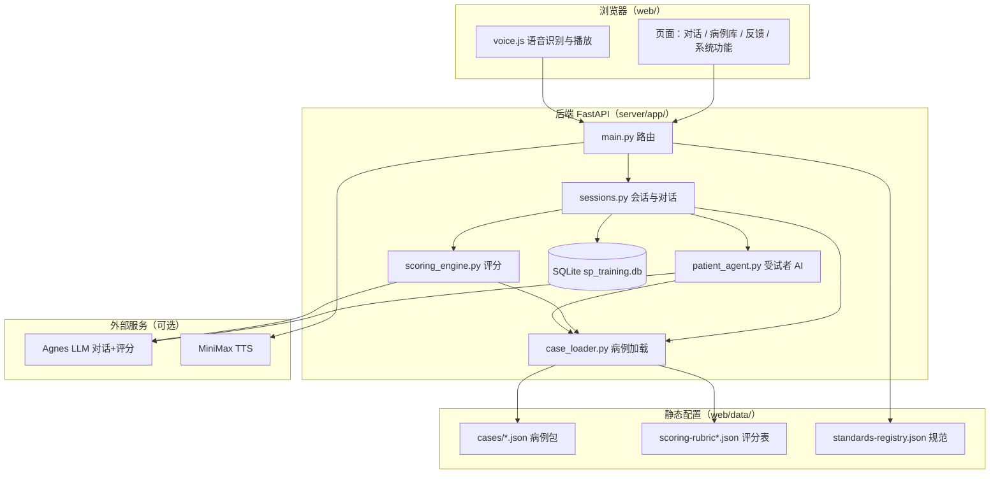
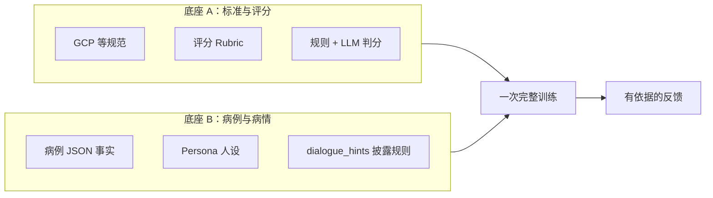
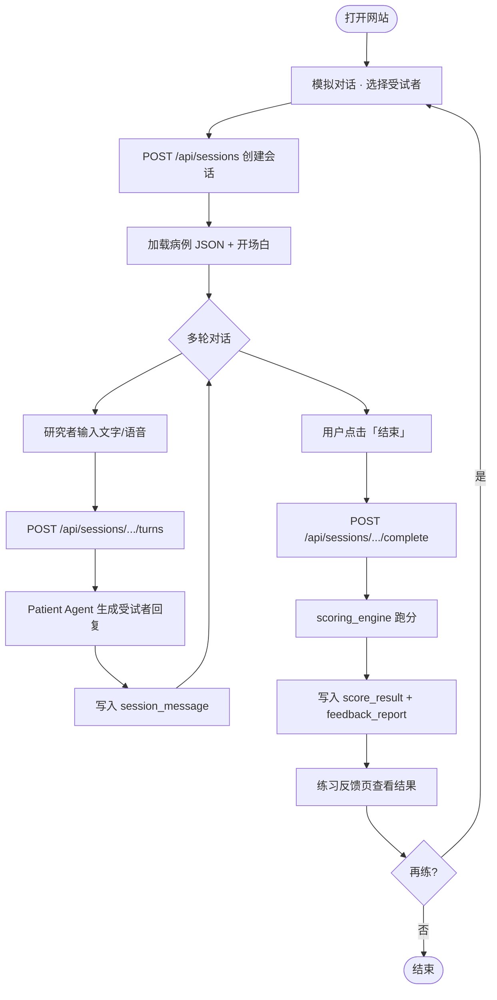
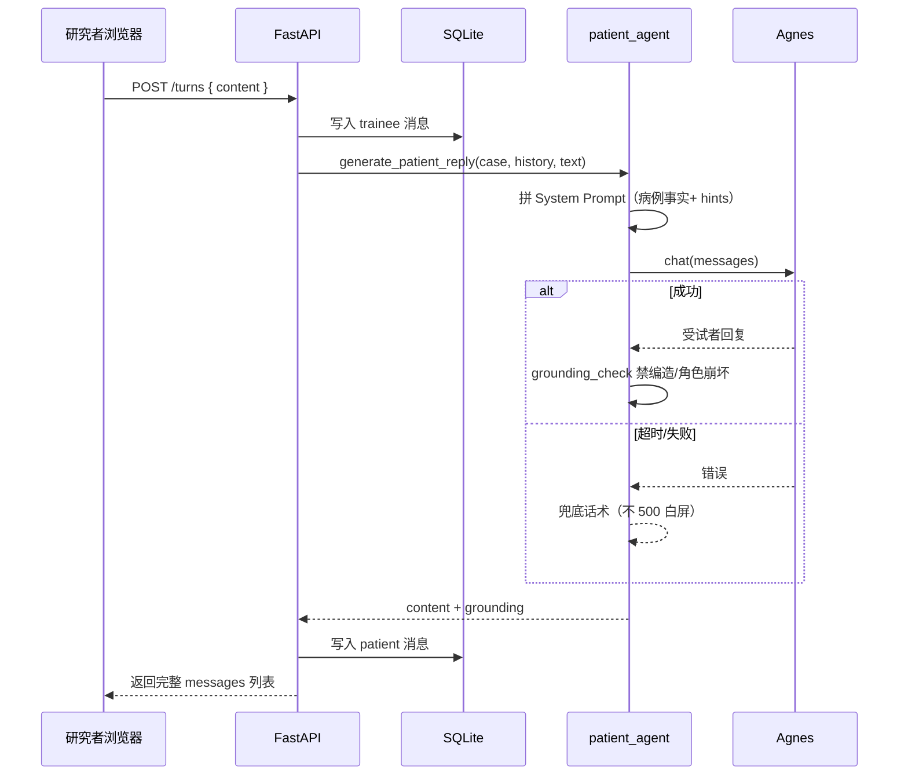
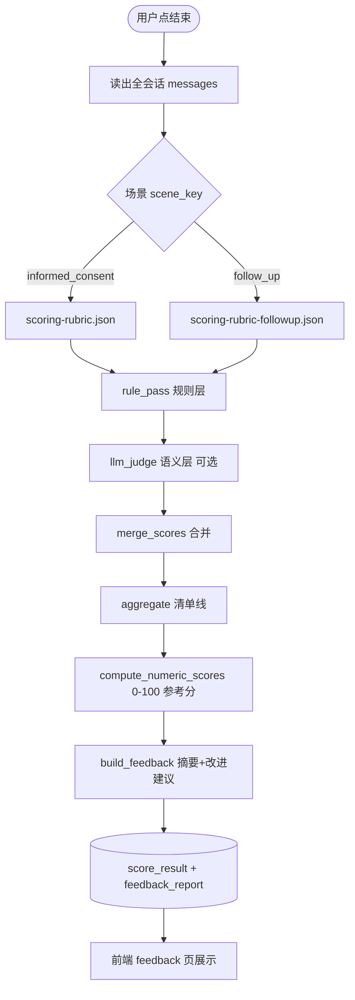
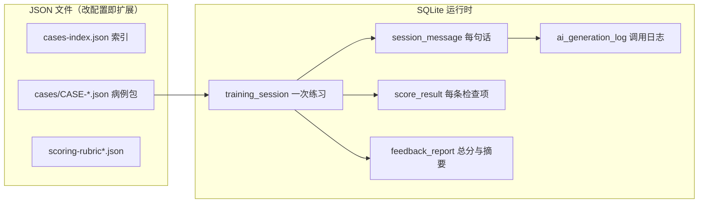
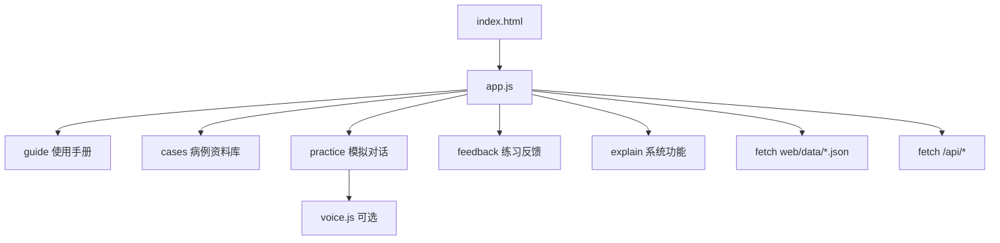
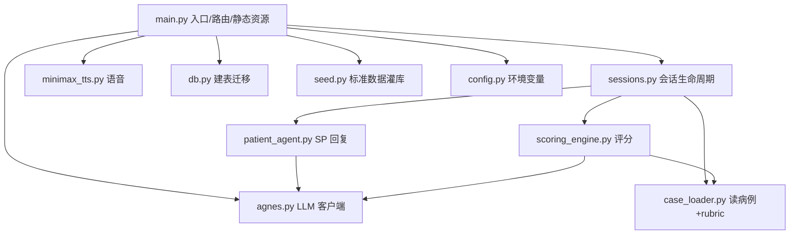
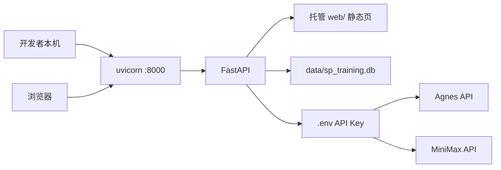

# AISP 技术架构（人话版）

> **AI 临床试验受试者模拟与沟通训练平台**  
> 文档版本：2026-08-27 · 对齐当前代码，不讲空话  
> 配套：[AISP-项目计划书](./AISP-项目计划书.md) · [AISP-PRD](./AISP-PRD.md)

---

## 1. 这套系统怎么拆

说白就三层：

1. **浏览器页面** — 选人、聊天、看反馈  
2. **Python 后端** — 管会话、调 AI、算分、写数据库  
3. **配置文件 + 外部 AI** — 病例/rubric 用 JSON；对话和评分走 Agnes；语音可选 MiniMax  

没有微服务，没有 RAG 服务，没有 PostgreSQL——**先把一条链路跑稳**。

---

## 2. 总体架构图



---

## 3. 双底座（为什么架构长这样）

训练要同时成立两件事，缺一边整个项目就虚：



- **底座 A** 回答：说得对不对、漏了啥（尺子）  
- **底座 B** 回答：病人像不像这个病、会不会瞎编（病人）  

---

## 4. 用户练一次完整流程



**要点：**

- **结束只能人点**，系统不会自动掐  
- 每一句对话都**落库**，后面评分和复盘都靠这份记录  

---

## 5. 单轮对话内部怎么走



**Patient Agent 三条硬规矩（写在 Prompt 里）：**

- 只按病例 JSON 说话，不知道就说「记不清」  
- 不当医生，不宣教 GCP  
- 问得细、态度平和才多透露（`dialogue_hints`）  

---

## 6. 结束评分怎么走



**评分只盯研究者说的话** — 从 `role=trainee` 的消息里找证据，SP 主动说的不算你得分。

**输出两样东西：**

| 输出 | 含义 |
|------|------|
| 清单线 | L1 是否全 pass、红线有没有踩 |
| 参考分 | 0–100，维度加权，60 及格 |

---

## 7. 数据存在哪



**病例怎么扩：** 新增 `CASE-xxx.json`，在 `cases-index.json` 挂一个 Persona，**不用改表结构**。

---

## 8. 前端怎么组织

单页应用思路，**没有 React/Vue**，就是 `web/js/app.js` 按路由渲染：



页面路由用 hash：`/#practice`、`/#feedback` 等。

---

## 9. 主要 API（后端入口）

| 接口 | 干什么 |
|------|--------|
| `POST /api/sessions` | 开一次新练习 |
| `POST /api/sessions/{id}/turns` | 研究者说一句话，拿受试者回复 |
| `POST /api/sessions/{id}/complete` | 结束并评分 |
| `GET /api/sessions/{id}/feedback` | 取反馈详情 |
| `GET /api/sessions/history` | 历史列表 |
| `GET /health` | 健康检查 |
| `POST /api/voice/tts` | 受试者语音朗读（可选） |

---

## 10. 代码模块一张图



---

## 11. 技术选型（为什么这样选）

| 层 | 选型 | 人话理由 |
|----|------|----------|
| 前端 | 静态 HTML + JS | 演示快、依赖少、改页面直接刷新 |
| 后端 | FastAPI | Python 写 AI 逻辑顺手，自动 OpenAPI |
| 数据库 | SQLite | 单机演示够用，会话/反馈一体 |
| 病例 | JSON 文件 | 医学同事可 review diff，不加后台也能扩 case |
| 对话/评分模型 | Agnes（OpenAI 兼容 API） | 统一接口，对话和评分复用 |
| 语音 | 浏览器 STT + MiniMax TTS | 可选增强，不影响文字闭环 |

**刻意没上的：** PostgreSQL、pgvector RAG、独立 Agent 微服务、Redis——等真有「多机构并发 + 知识库检索」需求再加。

---

## 12. 部署长什么样



启动命令见 [README.md](./README.md)：

```bash
python -m uvicorn server.app.main:app --host 127.0.0.1 --port 8000
```

---

## 13. 和「计划书里的理想架构」差在哪

队友文档里常见的 **Patient Agent + Evaluator Agent + RAG + pgvector + 五维状态机**，是合理的中期目标。  
**当前实现是合并版：**

| 理想组件 | 现状 |
|----------|------|
| Patient Agent | ✅ `patient_agent.py` |
| Evaluator Agent | ✅ 合在 `scoring_engine.py`，不是独立服务 |
| RAG 知识库 | ❌ 规范在 JSON/DB seed，未做向量检索 |
| 状态机（Trust/Anxiety 数值） | ⚠️ 用 `dialogue_hints` + Prompt，无数值状态条 |
| 管理后台 | ❌ |
| 用户登录 | ❌ |

扩展路径：**先 stabilise 文字闭环 → 再拆 Evaluator 服务 → 再上 RAG 和管理端**。

---

## 14. 相关文档

| 文档 | 内容 |
|------|------|
| [项目架构设计文档.md](./项目架构设计文档.md) | 双底座与规范细节（偏设计论证） |
| [数据库设计文档.md](./数据库设计文档.md) | 表结构说明 |
| [AI设计文档.md](./AI设计文档.md) | Prompt 与 Agent 细节 |
| [评分设计说明.md](./评分设计说明.md) | 分数公式 |

---

*看图请用支持 Mermaid 的编辑器（VS Code、GitHub、Cursor）打开本文。*
