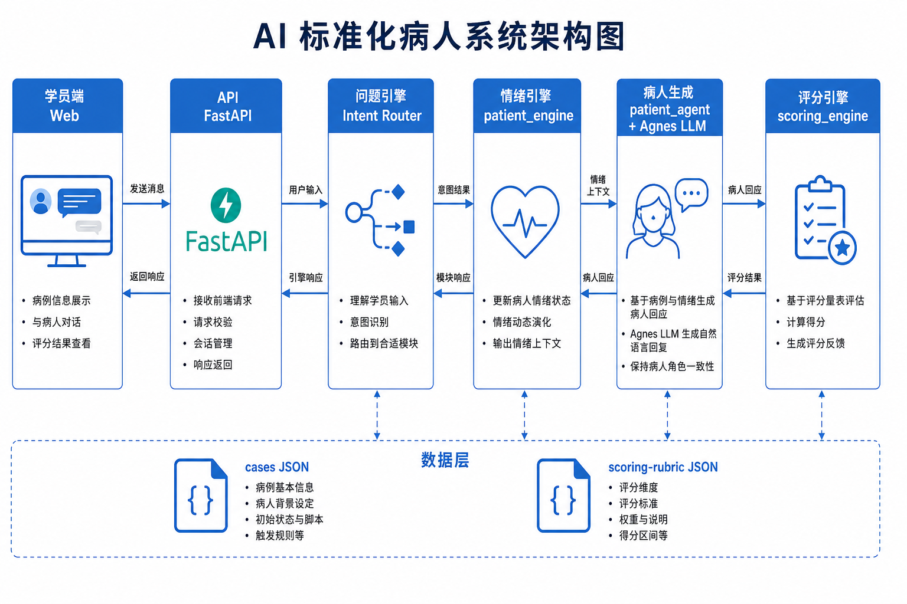
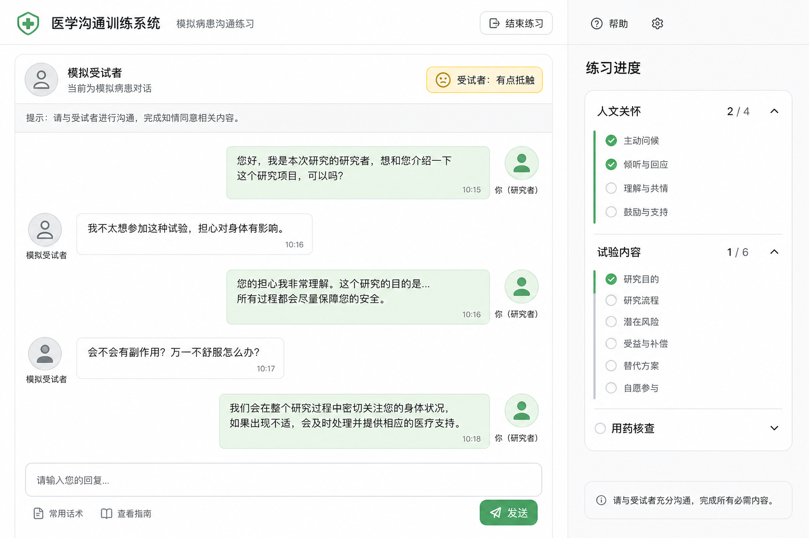

# 问题引擎与对话多样性（PRD 2.0）

> **怎么读本文：** 先听一个故事 → 从故事里捞出问题 → 再看我们怎么用「问题引擎 + 对话多样性」解决。  
> 讲给别人听时，也按这个顺序：**故事 → 问题 → 设计**。  
> 场景与多人见 [01-场景设计.md](./01-场景设计.md)；评分见 [09-评分体系与练习考核.md](./09-评分体系与练习考核.md)。

---

## 一、先讲故事：小刘的一下午

### 1.1 第一次 · 跟王阿姨知情同意

小刘点开 **王阿姨**。开练页只写了几条模糊 checklist，他并不清楚：今天这人听力不好、会问脚麻、女儿在门外等。

一开场，王阿姨说：「大夫，我女儿在外面等，您说慢点。」  
小刘有点快，她打断：「您说得太快了，我跟不上。」  
他放慢，讲退出权，她又问：「不参加以后还能正常看糖尿病吗？」

练完，侧栏有几个检查点变绿，但他分不清：刚才到底覆盖的是「人文」还是「关切」？结束有一份分项反馈。

### 1.2 第二次 · 还是王阿姨

他想：「再练一遍，应该不一样。」

开场又是类似的「说慢点」；问「试验大概多久」，回答听着也像上一遍。  
他心里咯噔一下：**是不是系统只会背同一套稿？**

其实后台可以换开场、换说法——但 **界面没告诉他「这次会话有什么不同」**，字面又碰巧相近，体感就是「每次一样」。

### 1.3 第三次 · 换成李建国随访

局变了：桌上有药盒、日记。建国进门：「行，没什么大问题，药基本都吃了。」

小刘问：「都吃了吧？」  
建国：「嗯，基本都吃了。」——进度几乎不动。

他有点急：「你怎么能忘记吃！」  
建国变短：「我也不是故意的……记不太清。」侧栏出现「有点抵触」。

他改口：「不是责怪，哪一天没吃？」  
建国才说：「去女儿家那天……忘了。」再追问，才带出次数、头晕、药盒对不上。

小刘这才明白：随访不是「听他说没事」就过关，系统在看他 **问没问到点子上、态度对不对**。

### 1.4 第四次 · 考核模式

他切到考核。过程中右侧 **不再细说哪一小项已覆盖**，只有粗进度。  
结束后仍有完整报告——不是「考核没反馈」，是 **考时不泄题，考完再复盘**。

---

## 二、从故事里发现问题

把小刘遇到的事收成 **四个产品问题**。后面的设计，就是冲着这四个问题来的。

| # | 故事里发生了什么 | 暴露的问题 |
|---|------------------|------------|
| **P1** | 问「都吃了吧」几乎没进度；问「哪一天忘了」才推进 | 系统要能判断：**学员这句话在考哪个点**，并更新过程进度 |
| **P2** | 责备→更瞒；安抚→松口 | SP 不能复读机，要按 **态度** 改变「说到多深、怎么接」 |
| **P3** | 连开两次王阿姨，觉得「每次一样」 | 需要 **可控的多样性**（开场、说法、情绪轨迹），且学员 **看得见** |
| **P4** | 若 SP 自己编「漏服五次」而病例是三次 | **事实必须锁死**；多样只能多样在「说法」上 |

另外还有边界：

- 练习要细进度，考核过程要粗 —— 对应小刘第四次  
- 全程不能另搭一个无关网站 —— 在现有对话链路里扩展  

**一句话：**  
故事说明我们缺的不是「再做一个聊天机器人」，而是 **问题引擎（每轮怎么理解、怎么推进、怎么约束 SP）** + **对话多样性（怎么不一样、又不乱）**。

---

## 三、设计总览：我们准备怎么解决

### 3.1 两块能力各管什么

| 能力 | 解决哪个问题 | 人话定义 |
|------|--------------|----------|
| **问题引擎** | P1、P2、P4 的「管住」 | 每一轮：听懂学员在干什么 → 更新进度 → 更新 SP 状态 → 在事实边界内回话 |
| **对话多样性** | P3，并服务 P2 | 开场、人设反应、说法、情绪轨迹可以不同；医学事实不能漂 |

### 3.2 一张总图（讲的时候指这里）

```text
【开练前】左卡：练什么（评分大类）  右卡：这人是谁（病例背景）
                    ↓
【每一轮】  学员说话
               │
               ├─① 意图识别 ──→「在考哪个点」（解决 P1）
               ├─② 覆盖进度 ──→ 练习细 / 考核粗（解决 P1 + 练考差异）
               ├─③ 情绪披露 ──→ 信任、能说到多深（解决 P2）
               └─④ 约束生成 ──→ 锁事实 + 抽说法 + 说人话（解决 P3、P4）
                    ↓
【结束】    样本够 → 正式评分报告；不够 → 暂无参考分
```

架构图：



下面 **第四节讲问题引擎怎么设计**，**第五节讲多样性怎么设计**。讲的时候可以先说总图，再展开。

---

## 四、问题引擎 · 具体怎么设计

用小刘问李建国那一句，把四个步骤设计讲清楚。

> 学员说：「建国师傅，最近有没有哪天忘记吃药？」

### 4.1 第一步：意图识别 ——「他在考哪个点？」

**设计目的：** 解决 P1。没有这一步，系统不知道该推进哪条进度。

**怎么做：**

1. 看学员这句话里的线索（关键词 / 规则，MVP 先不用复杂模型）  
2. 映射到评分小项和大类  

| 学员大致在说 | 系统判定 | 大类 |
|--------------|----------|------|
| 哪天忘了吃、漏服 | 漏服核查 | 用药核查 |
| 头晕、不舒服 | AE | 用药核查 |
| 不是责怪、了解真实情况 | 非责备沟通 | 人文 |
| 怎么能忘记、你就加一片 | 红线风险 | 红线 |

知情同意场景同理：讲风险 → 试验内容；回应「能退出吗」→ 关切；「必须签」→ 红线。

**讲给别人听的一句：**  
意图不是最终打分，是 **给这一轮贴标签：你在朝哪个考点努力**。

### 4.2 第二步：覆盖进度 ——「过程条怎么亮？」

**设计目的：** 仍服务 P1，并区分练习 / 考核。

**怎么做：**

| 模式 | 过程中展示 | 为什么 |
|------|------------|--------|
| 练习 | 大类，必要时到小项「可能已覆盖」 | 帮助学习 |
| 考核 | 只显示大类粗进度 | 防泄题 |

- 「都吃了吧？」→ **不亮** 漏服（太笼统）  
- 「哪一天忘记吃药？」→ **可能亮** 漏服（问到点子上）  
- 亮的是 **likely**，不是最终得分；0～100 在 **结束且样本够** 时再算  

界面目标：



**讲给别人听的一句：**  
过程进度 = 导航仪；结束评分 = 成绩单。两件事别混。

### 4.3 第三步：情绪与披露 ——「这一轮 SP 敢说多深？」

**设计目的：** 解决 P2。跟 [01](./01-场景设计.md) 运行时一致：人设 × 场景 × 情绪。

**怎么做（设计规则，不是口号）：**

1. **读人设底色**（建国怕批评 → 默认会藏）  
2. **套场景角色**（随访 = 你问他答，他不该一进门全倒）  
3. **按本轮语气改情绪**（责备 → 信任降、披露浅；安抚+具体问 → 信任升、可说细节）  
4. **输出本轮约束**：允许提哪些事实、说话方式倾向（短/可展开）、接话倾向  

对应故事：

| 小刘说 | 引擎判定 | 建国被允许的行为 |
|--------|----------|------------------|
| 「都吃了吧？」 | 问法笼统 | 只许含糊：「基本都吃了」 |
| 「你怎么能忘！」 | 责备 | 更浅、更防备，不主动交代三次漏服 |
| 「不是责怪，哪一天？」 | 安抚+具体 | 允许说出「女儿家那天」等细节 |

**讲给别人听的一句：**  
情绪引擎管的是 **整套行为**（说什么、多深、怎么接、语气、长短），不是只截字数。

### 4.4 第四步：约束生成 ——「怎么说出口又不编事实？」

**设计目的：** 解决 P3 的「说法层」+ P4 的「事实锁」。

**怎么做：**

```text
病例里锁死：漏服次数 = 3（事实）
     ↓
从预置的多种口语里抽一句（说法）
     ↓
加上本轮「允许说多深」「说话方式」
     ↓
LLM 只负责说得像人 —— 不准 invent「漏服五次」
```

**讲给别人听的一句：**  
**随机的是说法，锁死的是事实；模型说人话，不编病情。**

### 4.5 问题引擎四步 · 串成一条可背的讲稿

> 学员每说一句：  
> ① 先判断他在考哪个点；  
> ② 再更新练习/考核进度；  
> ③ 再按人设、场景、情绪决定 SP 能说多深；  
> ④ 最后在锁死事实的前提下，用变体说法说人话。  
> 规则管边界，模型管口语。

---

## 五、对话多样性 · 具体怎么设计

故事里小刘「两次王阿姨觉得一样」——多样性要 **分层设计**，并且 **开练页要让人看见**。

### 5.1 四层分别解决什么

| 层 | 设计成什么 | 解决什么体感 | 例子 |
|----|------------|--------------|------|
| **开场层** | 多种第一句话，开练随机抽 | 一进门就一样 | 王阿姨：女儿在外等 / 脚麻 / 请说慢点 |
| **人设层** | 不同病例不同关切与接话习惯 | 换人还像同一个人 | 大爷问退出；大妈问钱；建国先说没事 |
| **说法层** | 同一 `fact` 多种 utterances | 同问同答一字不差 | 「两周」/「14 天」/「记不清两三周」 |
| **情绪轨迹层** | 你态度变 → 他接话与披露变 | 像背稿不会反应你 | 责备更瞒；安抚后松口 |

少任何一层，都容易回到小刘的抱怨：「怎么每次都一样？」

### 5.2 为什么不靠「让 AI 自由变」做多样性

回到会出事的版本：自由发挥会把「漏服 3 次」说成 5 次、1 次——**训练作废**。

所以多样性的设计边界是：

| 可以变 | 不能变 |
|--------|--------|
| 开场句、口语措辞、重复确认的方式、情绪下的长短与配合度 | 试验关键事实、漏服次数、AE 关键、药盒应剩片数等 |

### 5.3 多样性如何「被看见」（否则引擎白做）

| 设计 | 小刘会有什么感受 |
|------|------------------|
| 开练右卡写清「听力差 / 先问钱 / 会先说没事」 | 知道这次练的重点 |
| 同病例三次开场不同 | 不像复读 |
| 同事实三种说法 | 像真人回忆 |
| 态度变了侧栏心情/披露跟着变 | 知道系统在反应我 |

**讲给别人听的一句：**  
多样性 = 四层叠加 + 界面可见；不是模型越随机越好。

### 5.4 和问题引擎的关系（别讲成两套无关系统）

```text
多样性四层，嵌在引擎流水线里：

开场层 ──→ 开练时定下本场第一句 / 本会话特点
人设层 ──→ 第③步读底色；第④步关切话题
说法层 ──→ 第④步 answer_pool
情绪层 ──→ 第③步每轮更新
意图/进度 ──→ 第①②步（不管多样，管「练没练到点」）
```

---

## 六、知情 vs 随访：意图设计差在哪（方便对照讲）

同一套引擎，**场景不同，意图表不同**——这是场景层挂进来的方式。

### 6.1 知情：很多分在「他问你答」

| 学员在做什么 | 系统在认什么 |
|--------------|--------------|
| 讲目的、风险、获益不确定 | 试验内容 |
| 回应退出、钱、脚麻等担心 | **关切**（关键） |
| 强迫、包治 | 红线 |

### 6.2 随访：很多分在「你问他答、问具体」

| 学员在做什么 | 系统在认什么 |
|--------------|--------------|
| 漏服/AE/合并用药/药盒/日记/血压 | 用药核查 |
| 非责备、问具体日期 | 人文 |
| 责备、自行医嘱 | 红线 |

**讲给别人听：**  
知情引擎重点看你有没有 **回应关切**；随访引擎重点看你有没有 **问到细节、态度对不对**。

---

## 七、你对外可以这样讲（3 分钟提纲）

1. **故事：** 小刘练王阿姨觉得每次一样；练李建国发现「都吃了吧」不够、责备会更瞒。  
2. **问题：** 系统要认考点、要反应态度、要多样且不漂事实、练考进度要分粗细。  
3. **设计：** 问题引擎四步——意图 → 进度 → 情绪披露 → 约束生成。  
4. **多样：** 开场 / 人设 / 说法 / 情绪四层；说法可变，事实锁死。  
5. **收尾：** 规则管边界，模型管口语；开练左右卡让设计看得见。

---

## 八、落点与验收

| 要做的 | 对应故事里的问题 |
|--------|------------------|
| 每轮返回 coverage + 心情 | P1、练考差异 |
| 开练左右卡（练什么 + 这人是谁） | P3 可见性 |
| 病例补全开场池 + 答案变体池 | P3、P4 |
| 情绪/披露规则对齐人设场景 | P2 |
| 结束正式评分（样本门槛见 09） | 成绩单 |

**验收演示建议（按故事演）：**

1. 同病例开两次，指开场不同 / 右卡特点  
2. 李建国：笼统问不亮 → 具体问才亮  
3. 责备更瞒 → 安抚后松口  
4. 同事实两种说法、次数仍是 3  
5. 考核过程只有粗进度，结束有报告  

---

## 九、和其他文档的关系

| 文档 | 和本文的分工 |
|------|--------------|
| [01-场景设计.md](./01-场景设计.md) | 场景/病例/运行时三层；开练左右卡；SP 五维行为 |
| [03-病人AI思考逻辑.md](./03-病人AI思考逻辑.md) | 李建国藏话细节可加演 |
| [09-评分体系与练习考核.md](./09-评分体系与练习考核.md) | 大类分数、样本门槛、结束报告 |

---

*读完应能按「故事 → 四个问题 → 引擎四步 → 多样四层」对外讲清，而不是背模块名词。*
