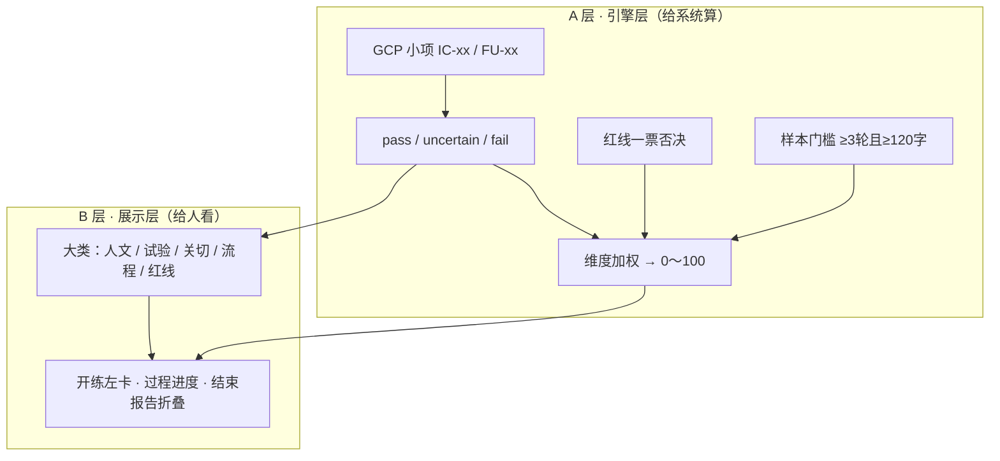
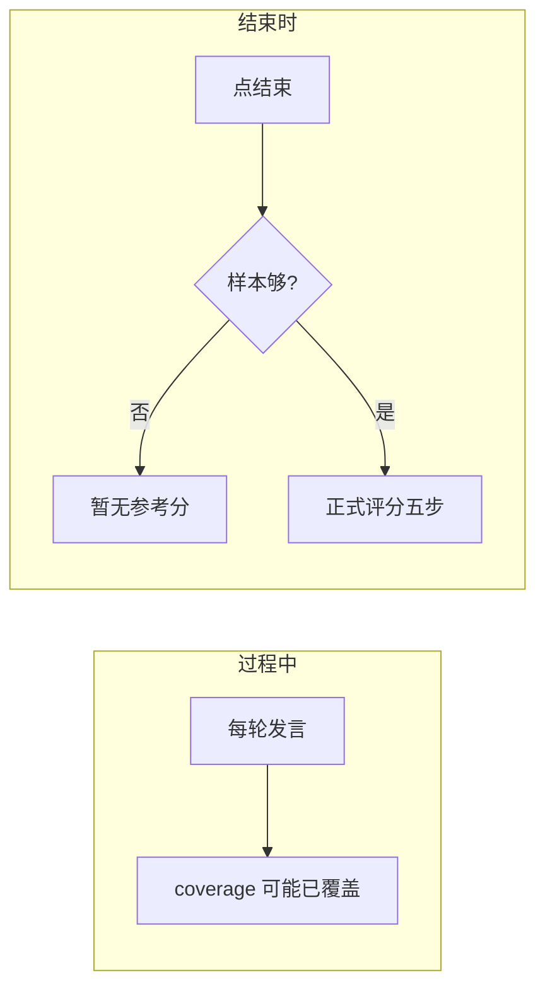
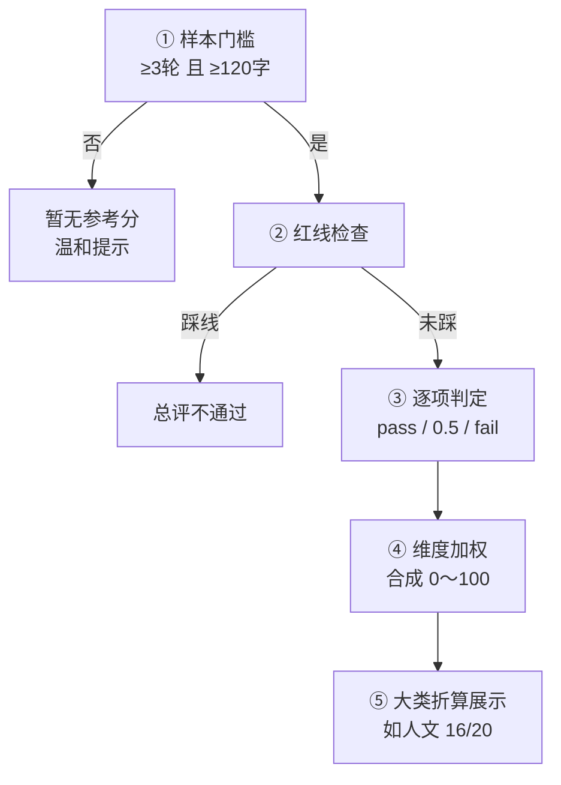

# 评分体系 · 练习与考核（PRD 2.0 真源）

> **怎么读：** 先听故事 → 从故事捞出问题 → 再看「双层评分 + 练/考差异」怎么设计。  
> 对外讲也按这个顺序。本文是「怎么练、怎么评、怎么反馈」的设计真源。  
> 关联：[01-场景设计.md](./01-场景设计.md) · [02-问题引擎与对话多样性.md](./02-问题引擎与对话多样性.md) · [08-小组讨论纪要-2026-09-02.md](./08-小组讨论纪要-2026-09-02.md) · [10-队友评分设计收集与对比.md](./10-队友评分设计收集与对比.md)

---

## 〇、定调（先读这四句）

1. **反馈主结果 = 规范清单核对：** 做了哪些 / 没做哪些、哪些达标 / 哪些未达标（可附对话证据）。  
2. **参考分可选但推荐保留：** 0～100 是清单结果的**教学汇总**，须说明「非法规法定分、非问卷统计」；权重是训练约定，可后调。  
3. **两条路都合法：** 只做清单；或「参考分 + 清单」——**不能**只有一个分数、不列达标项。我们采用第 2 条。  
4. **队友材料：** 吸收条目思路、红线类型、五类 SP、李建国随访考点、法规「评什么」；**不吸收**问卷赋分与 A48… 整数权重、不用关键词 ≥80% 当唯一判定。详见 [10](./10-队友评分设计收集与对比.md)。

**真源文件：** `web/data/scoring-rubric.json` · `web/data/scoring-rubric-followup.json` · `server/app/scoring_engine.py` · 规范索引 `web/data/standards-registry.json`

---

## 一、先讲故事：小刘练完一场，分数从哪来？

### 1.1 开练前

小刘选 **张大爷 · 知情同意**。页面左右两张卡：

- **左卡：** 今天练五大块——人文、试验内容、关切、流程、红线（各有展示分）  
- **右卡：** 张大爷是谁、可能反复问退出和疗效  

他心里有数：**练什么、跟谁练**。

### 1.2 练习过程中

他讲风险、回应「能退出吗」。右侧进度一点点亮：

- 「关切 · 退出权 → 可能已覆盖」  
- 「试验内容 · 风险 → 还没提到」  

注意：这是 **导航**，不是最终成绩单。

### 1.3 点结束

聊了 6 轮、字数够。报告**先给清单**：风险 ✓、退出权 ✓、补偿 ✗……  
再给大约 **85 分参考分**（汇总用），按大类折叠后仍可点开每条 pass/fail 和对话证据。

### 1.4 换考核模式

过程中只看到 **「试验内容约 40%」** 这种粗条，看不到「某一小项已得 2 分」。  
考完 **一样有完整报告**——不是没反馈，是 **考时不泄题**。

### 1.5 有人只聊两句就交卷

系统 **不是报错页**，而是：

> 对话样本不足，暂无参考分，建议至少再练几轮。

防止背两句固定话术刷绿点。

**这就是评分体系要交付的体验。** 下面从故事里抽问题，再讲设计。

---

## 二、从故事里发现问题

| # | 故事里 | 问题 |
|---|--------|------|
| **S1** | 要看「人文 16/20」，底下又有 IC-P03 等编号 | 学员要看 **大类地图**；系统要靠 **GCP 小项** 算分——需要 **两层**，不能只留一层 |
| **S2** | 过程亮灯 ≠ 结束 85 分 | **过程进度** 和 **正式评分** 必须分开 |
| **S3** | 练习细、考核粗，结束都有报告 | 练/考差异要写清，别说成「考核没反馈」 |
| **S4** | 两句交卷无参考分 | 要有 **最低样本门槛**，文案要温和 |
| **S5** | 「能退出吗→可以」算过关，不必背固定句 | 看 **语义达标**，不是关键词命中率或固定句 |
| **S6** | 有人只认「权威分值表」 | 规范只规定评什么；参考分是教学汇总，必须同时展示清单 |

---

## 三、设计总览：清单为主 + 双层 + 两条时间线

### 3.1 一张总图（先看懂这个）




| 层 | 给谁 | 干什么 | 现状 |
|----|------|--------|------|
| **A 引擎层** | `scoring_engine.py` | 小项判定、加权、红线、样本门槛 → 0～100 | 已有 |
| **B 展示层** | 学员 / 导师 / 答辩 | 大类、导览、进度条、报告折叠 | 要补 `groups` + UI |

**对外一句：**  
主结果是清单达标与否；参考分是 A 层加权汇总；B 层大类是给人看的地图——**不推翻现有引擎，不接问卷赋分表**。

### 3.2 为什么大类 20 分不是「每项 2 分加总」

引擎里小项、维度已有权重（如关切更重）。强行改成每项固定 2 分要重写引擎。

**做法：**

- **总分：** 仍按 A 层维度加权 → 0～100  
- **大类分（展示）：** 该大类下小项达成率 × 大类展示满分（如 20）  

所以「人文 16/20」是 **折算给学员看的**，不是另一套计分公式。

### 3.3 两条时间线（别混）



| 时机 | 在干什么 | 算不算最终分 |
|------|----------|--------------|
| 每轮后 | 规则猜「可能覆盖了哪些点」 | **不算** |
| 点结束且样本够 | 红线 + 小项 + 加权 + 大类折算 | **算** |

---

## 四、结束正式分 · 五步怎么走（可当讲稿）

学员点「结束」后，按顺序过五关：



| 步 | 人话 | 设计要点 |
|----|------|----------|
| ① 样本 | 聊太少先不给参考分 | ≥3 轮且 ≥120 字；**不是报错** |
| ② 红线 | 强迫、包治、责备恐吓等 | 一票否决 |
| ③ 小项 | 这条语义达标了吗 | 看 `pass`/`fail`；**这是反馈主结果** |
| ④ 加权 | 合成参考总分 | 教学约定权重（见下）；须在 UI/说明中标注「参考」 |
| ⑤ 大类 | 报告好读 | 只用于展示折叠 |

**知情维度（现行约定）：** L1 必达 50% + 关切 30% + L2 过程 20%  
**随访维度（现行约定）：** L1 核查 55% + L2 安排 25% + 沟通 20%  

权重来源 = **训练设计默认值**（可导师标定后改），不是法规分值，不是问卷。

代码：`scoring_engine.py` 中 `MIN_TRAINEE_TURNS=3`、`MIN_TRAINEE_CHARS=120`。

---

## 五、B 层大类长什么样（学员看到的地图）

### 5.1 知情同意（张大爷 / 王阿姨 / 张大妈）

评分文件：`scoring-rubric.json`

| 大类 | 展示分 | 学员在干什么 | 典型小项 |
|------|--------|--------------|----------|
| G-01 人文关怀与沟通 | 20 | 讲清楚、留时间答疑 | 通俗、答疑、自愿… |
| G-02 试验内容与风险获益 | 25 | 说明试验实质 | 目的、风险、获益不确定、退出… |
| G-03 回应受试者关切 | 20 | **SP 问完你要答** | 退出/疗效/副作用关切 |
| G-04 流程权利与安排 | 20 | 说明怎么参与 | 流程、补偿、联系、副本… |
| G-R 红线 | — | 绝不能踩 | 强迫、包治、瞒风险… |

### 5.2 随访（李建国）

评分文件：`scoring-rubric-followup.json`

| 大类 | 展示分 | 学员在干什么 | 典型小项 |
|------|--------|--------------|----------|
| G-01 沟通方式与人文 | 20 | 非责备、问具体 | FU-C01、C02 |
| G-02 用药与依从核查 | **35** | **主类**：漏服/AE/药盒… | FU-A01～A06 |
| G-03 随访安排与安全 | 25 | 联系中心、下次访视 | FU-P01～P03 |
| G-R 红线 | — | 责备、自行医嘱 | FU-X01、X02 |

两套场景 **大类名可以不同**，不必硬凑成同一个「5×20」。

### 5.3 小项怎么挂到大类（数据设计）

每个小项保留原来的 `pass` / `fail`，加上：

| 字段 | 含义 |
|------|------|
| `group_id` | 属于哪个大类 |
| `trainee_role` | 讲解 / 追问 / 回应关切 |
| `prompt_examples` | **问法示例**（可换说法，不是唯一标准句） |

```json
{
  "id": "FU-A01",
  "group_id": "G-02",
  "trainee_role": "ask",
  "prompt_examples": ["最近有没有哪天忘记吃药？"],
  "pass": "追问具体日期、原因、是否补服",
  "fail": "仅问「都吃了吧」未追问细节"
}
```

**对外一句：** 评分认的是「有没有问到点子上」，不是「有没有背中某一句」。

---

## 六、练习 vs 考核 · 同一套分，两种灯光

| | 练习 | 考核 |
|---|------|------|
| 过程进度 | 可到小项「可能已覆盖」 | **仅大类粗进度** |
| 过程「已得 X 分」 | 不显示 | 不显示 |
| 心情标签 | 可显示 | 隐藏 |
| 结束后 | 完整报告 | **同样完整报告** |
| 样本不足 | 暂无参考分 | 同左 |

```text
练习：过程细导航 → 结束出成绩单
考核：过程粗导航 → 结束出成绩单（标题可写「考核报告」）
```

---

## 七、和开练导览、对话的关系（避免孤立讲评分）

评分不是单独一张表，要和前面文档咬合：

| 环节 | 用评分的什么 | 文档 |
|------|--------------|------|
| 开练左卡 | B 层大类 + 红线 + 问法示例 | [01](./01-场景设计.md) |
| 每轮进度 | coverage（可能覆盖） | [02](./02-问题引擎与对话多样性.md) |
| SP 藏与松口 | 影响「问没问到」证据是否够 | [03](./03-病人AI思考逻辑.md) |
| 结束报告 | A 层算分 + B 层折叠 | 本文 |

---

## 八、对外 3 分钟讲稿

1. **故事：** 开练看大类 → 练习边聊边亮进度 → 结束先清单、再参考分；考核过程粗、结束仍有报告；两句交卷暂无参考分。  
2. **问题：** 清单要给人看清达标项；大类要导航；过程≠结束；练考要分粗细。  
3. **设计：** 清单为主 + **A 引擎 / B 展示**；参考分是汇总；结束五步。  
4. **收束：** 语义达标；样本门槛防刷分；不接问卷赋分。

---

## 九、落点与验收

### 9.1 本阶段优先做

1. rubric 增加 `groups[]`，小项加 `group_id`  
2. 开练左卡读大类 + 红线  
3. 每轮返回 `coverage`；练习细 / 考核粗  
4. 样本不足文案改温和  
5. 结束报告按大类折叠  

### 9.2 验收勾选

- [x] 开练前能讲清「今天几大类 + 红线」（`groups` + 开练导览）  
- [x] 练习过程有小项进度 + 大类粗条  
- [x] 样本不足 → 暂无参考分（温和文案，非报错）  
- [x] 样本够 → 参考分 + 大类折叠清单 + 可展开小项  
- [x] 考核过程仅大类粗进度，结束有完整报告  
- [ ] 无语音、无数字人也能演示全流程（产品级联调）  

自测：`python scripts/test_scoring_phase1.py`

### 9.3 病例范围

| 场景 | 人 | 评分文件 |
|------|-----|----------|
| 知情同意 | 张大爷、王阿姨（张大妈设计中） | `scoring-rubric.json` |
| 随访 | 李建国 | `scoring-rubric-followup.json` |

---

## 十、实现分期（给排期用）

| 阶段 | 做什么 |
|------|--------|
| Phase 1 | groups 入库、开练导览、过程 coverage、insufficient 文案 | **已落地**（2026-09-02） |
| Phase 2 | 队友李建国表 ↔ FU 小项映射试跑、`prompt_examples`、五类 SP 与 01 人设对齐 | 映射 JSON + prompt_examples 已入；人设字段对齐待续 |
| Phase 3 | 考核全屏等体验项 | 待做 |

详细组内口径见 [08](./08-小组讨论纪要-2026-09-02.md)；队友吸收边界见 [10](./10-队友评分设计收集与对比.md)。**讲产品优先用本文〇～八节。**

---

*读完应能讲清：清单核对是主反馈；参考分是教学汇总；双层 + 五步 + 练考差异。*
