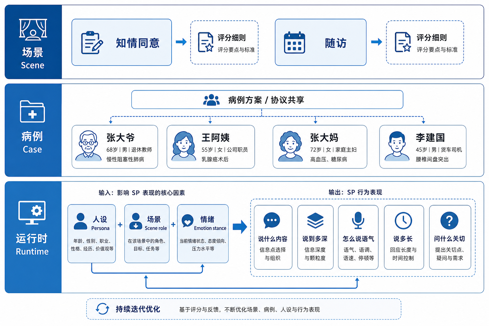
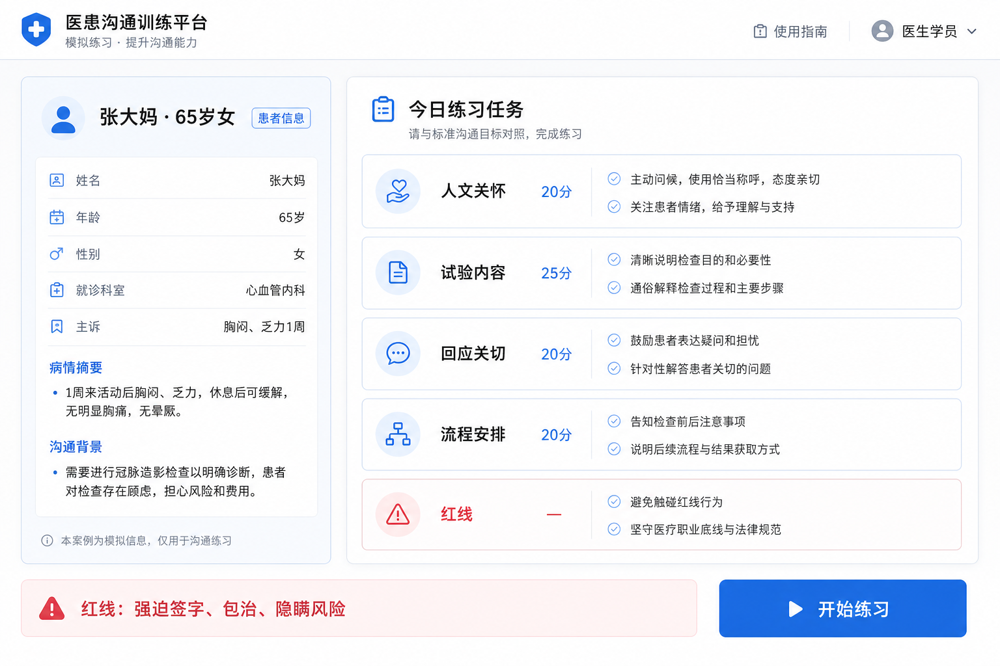
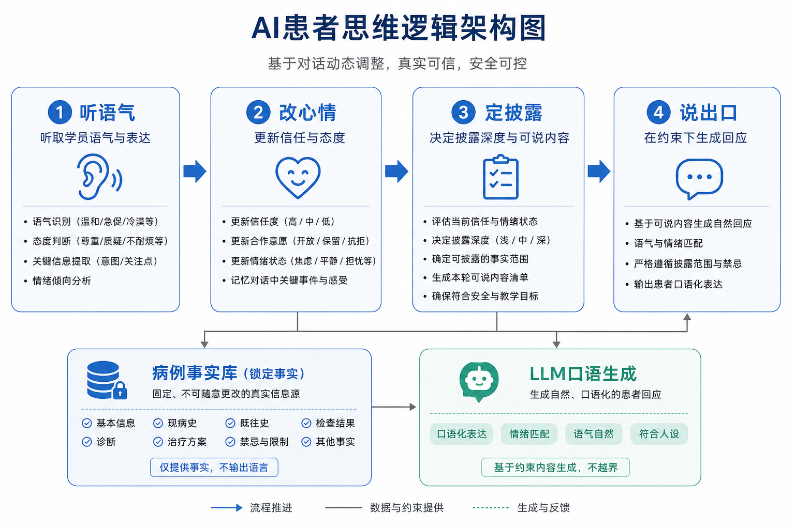
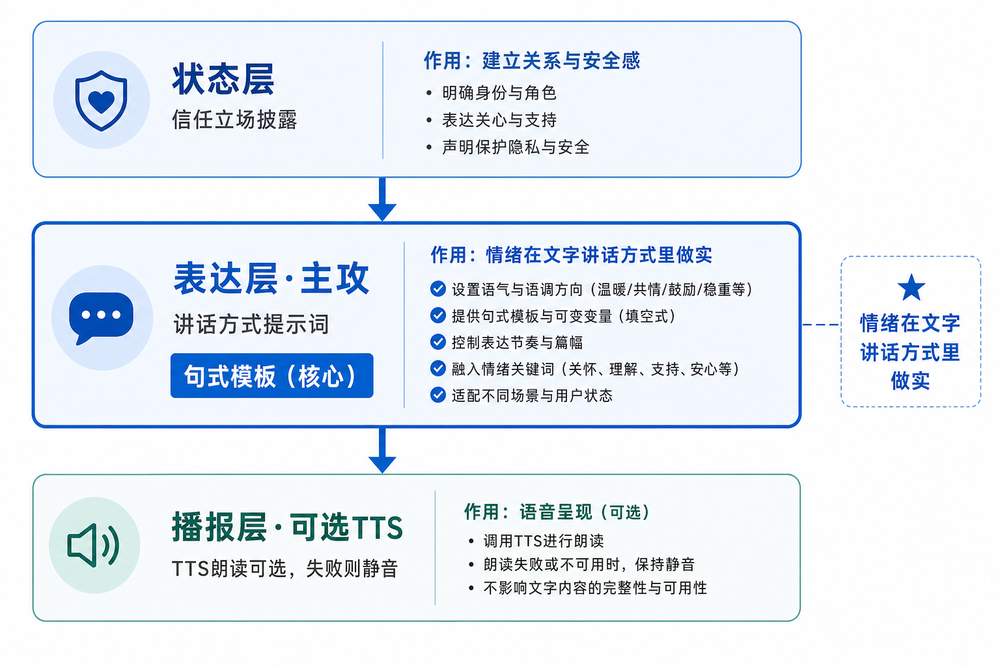
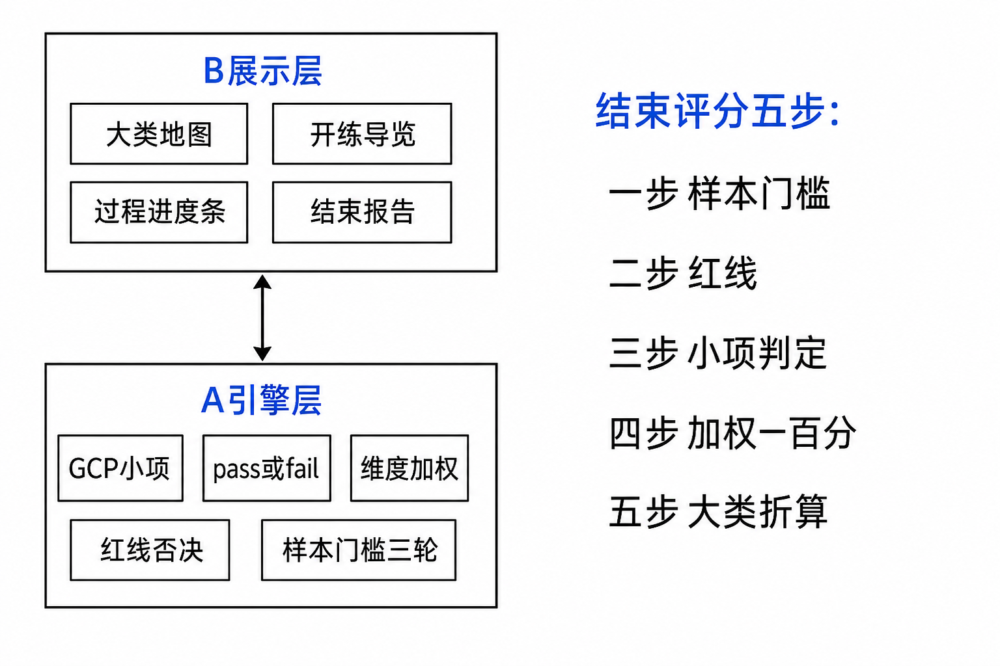
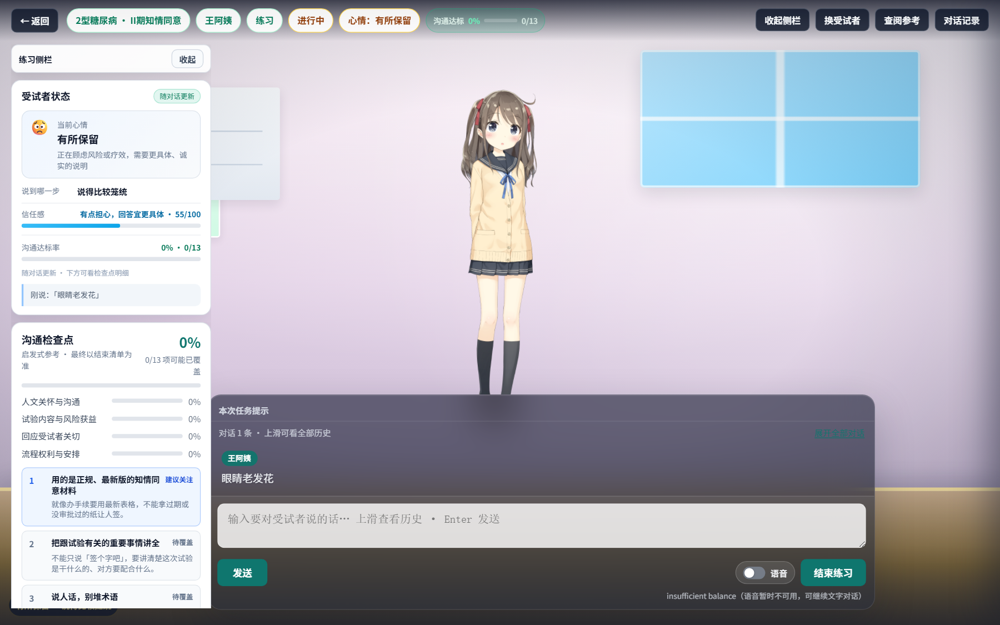

# AISP · 产品需求文档（PRD 2.0 总篇）

> **版本：** 2026-09-03 · 第四稿  
> **怎么读：** §一～二 定调 → §三 问题 → §四～六 场景/引擎/思考 → **§七～八 情绪与示范话术** → §九～十三 评分/管理/界面/实现  
> **分册索引：** [README](./README.md)

---

## 一、为什么要有 AISP

小刘是临床试验中心的新手协调员，马上要 **自己给受试者打随访电话** 了。

带教老师塞给他两份材料：一份是 **知情同意书**（讲试验是什么、有什么风险、参加人可以怎么选择），一份是 **随访操作说明**（电话该怎么问、要记录什么）。纸上有流程，但 **不能在真人身上练手**——问重了伤信任，问漏了出纰漏，受试者也不会配合你「重来一遍」。

老师的意思是：

> 别拿真人试错。先在系统里练：随访时 **要问清有没有漏吃药、哪里不对**，知情时 **要接得住人家问「能不能不做、能不能退出」**；练熟了再打电话。

以前科室也试过：同事互相扮演 patient，往往太配合；只看幻灯片又没有对话压力。大家真正需要的是：**可以反复练、可以换不同性格的人、练的时候就知道自己问到哪一步、练完能对着规范清单看漏了什么**——而不是做一个只能聊天的网页。

**AISP** 就是干这个的：用 AI 扮演 **标准化病人**（会隐瞒、会追问、会抵触），让学员练两类最难的话——

- **知情同意**：主要是 **你讲试验**，对方 **反复问担心的事**；  
- **随访询问**：主要是 **你问用药和记录**，对方 **先说「没事」，要追问才说实情**。

产品重点在 **怎么对话、怎么对照评分清单**，不在数字人好不好看。

---

## 二、故事引子（细节见 [01-场景设计](./01-场景设计.md)）

小刘在系统里练了四趟，后面的产品设计都从这些对话里长出来：

**李建国 · 随访电话** — 五十六岁出租车司机，入组第四周来复查。他嘴上说「药基本都吃了」，其实病例里写着 **漏吃过 3 次、有过头晕、还自己加过药，药盒和日记也对不上**。小刘先问「都吃了吧」→ 系统进度不动；一责备 → 建国更不肯说；改成「不是怪您，哪天没吃」→ 侧栏才提示「漏服核查 · 可能已问到」。**产品要练的就是中间这一步步怎么问。**

**张大爷 / 王阿姨 · 知情谈话** — 用的是 **同一套评分标准**，但人不一样：大爷爱问「能不能退出、有没有用」；阿姨听力差，要慢讲、要重复，还要回应脚麻、视力这些具体担心。**考的是同一类能力，跟不同人说话方式要换。**

**带教老张 · 往系统里加新病人** — 他不会写程序用的数据文件，只想：写个大概 / 把 Word 交给系统 / 自己写全文 → 审一遍 → 学员就能练。见 [11-管理端病例接入](./11-管理端病例接入.md)。

---

## 三、从故事捞出的六个问题

1. **笼统问不算练到点子上** — 「都吃了吧」不应推进漏服核查。  
2. **态度改变 SP 敢说到多深** — 责备更瞒，安抚+具体问才松口；事实不能编。  
3. **同 SP 多次练不能背同一稿** — 说法可变，漏服 3 次就是 3 次；差异要可见。  
4. **开练前就要有地图** — 左卡任务（大类+红线），右卡人物（今天什么局）。  
5. **过程要导航、结束才打分** — 「可能已覆盖」≠ 最终得分；考核过程粗、结束仍有报告。  
6. **加病例要人话接入** — 三路径人审；AI 整理格式可以，不能替人定医学事实。

下面 §四～十三 是围绕这六件事的 **设计正文**，与分册 **01 / 02 / 03 / 06 / 07 / 09 / 11** 等保持一致（总篇作汇总，细节以分册为准）。

---

## 四、场景与病例设计

> 对应分册：[01-场景设计.md](./01-场景设计.md)

### 4.1 「场景」在系统里是什么

两种 **临床局**，各配一张评分表 + 一个或多个病人 JSON：

| 局 | 系统名 | 学员在干什么 | 评分文件 |
|----|--------|--------------|----------|
| 知情同意室 | `informed_consent` | **讲试验 + 回应担心** | `scoring-rubric.json` |
| 第 4 周随访诊室 | `follow_up` | **逐项追问核查，非责备** | `scoring-rubric-followup.json` |

本阶段：**知情 3 人（张大爷、王阿姨、张大妈设计稿）+ 随访 1 人（李建国，已入库）**。

### 4.2 场景设计 · 整体架构（三层）

```text
┌─────────────────────────────────────────────────────────────┐
│ ① 场景层 Scene                                              │
│    这一「局」是什么：知情同意 / 随访                         │
│    配什么评分表、学员主责、桌上有什么、对话谁问谁答           │
├─────────────────────────────────────────────────────────────┤
│ ② 病例层 Case                                               │
│    同一场景下的具体人：张大爷 / 王阿姨 / 张大妈 / 李建国     │
│    试验方案可共用；人设、病况、开场、关切、藏话规则各自不同   │
├─────────────────────────────────────────────────────────────┤
│ ③ 运行时层 Runtime（每一轮对话）                             │
│    人设（整场稳定）× 场景角色（这一局）× 情绪（这一轮）       │
│    → 共同决定 SP「说什么、说到多深、怎么接话、语气、长短」  │
└─────────────────────────────────────────────────────────────┘
```



| 层 | 回答的问题 | 没有这一层会怎样 |
|----|------------|------------------|
| **场景** | 今天是哪种临床沟通？考什么？ | 知情和随访混成一套话术，评分也对不上 |
| **病例** | 今天面对谁？背景是什么？ | 只会背「张大爷专用稿」，换人就穿帮 |
| **运行时** | 这一轮该不该松口、该不该重复、该不该变短？ | SP 要么复读机，要么 LLM 乱编 |

**数据落点：** 场景 → `scene_key` + `scoring-rubric*.json`；病例 → `web/data/cases/*.json`；运行时 → `patient_engine.py` + 每轮 `emotion`。

**开练界面：** 左卡「今日练什么」= 场景 + 评分大类；右卡「这人是谁」= 病例背景；对话中的心情、松口、长短 = 运行时。

### 4.3 同一场景、多个病人

**不变：** 试验方案、场景类型、评分表。  
**变：** 每个病人的背景、性格、开场、关切、藏话方式 —— 写在各自 `cases/*.json`。

**张大爷** · 知情 · 68 岁退休男，爱重复问退出与疗效；学员重点：讲清目的/风险/获益不确定，回应退出与疗效关切。

**王阿姨** · 知情 · 72 岁，听力略差，脚麻视物模糊；开场「您说慢点」；学员重点：放慢、确认听懂，回应症状与常规治疗关系。

**张大妈** · 知情 · 设计稿 · 65 岁独居，先问钱、跑几趟、邻居谣言；被敷衍则想走；学员重点：别催签，讲清费用与访视负担。

**李建国** · 随访 · 56 岁司机，怕批评；嘴上「基本都吃了」，锁：漏服 3 次、第 18 天头晕、感冒药、自行加氨氯地平、药盒 10/7、日记补记；学员重点：非责备+具体追问，核对药盒/日记/AE。

### 4.4 李建国 · 随访怎么练

| | 知情（张/王/张大妈） | 李建国 |
|---|---------------------|--------|
| 角色 | 你 **讲**，SP **问** | 你 **问**，SP **答** |
| 桌上 | 知情同意书 | 药盒、日记、血压本 |
| 评分大类 | 人文/试验/关切/流程 | **人文 / 用药核查(35) / 随访安排 / 红线** |

**病例锁死的核查点（SP 不能乱编）：** 完全漏服第 10、19、24 天共 3 次；第 18 天头晕约 20 分钟未联系中心，第 19 天自行停药；第 21–22 天感冒药，第 26 天自行加氨氯地平；药盒应剩 7 片实剩 10 片；日记第 10 天空白，第 19、24 天来前补记。

**四幕 · 你怎么问，他怎么变：**

1. 进门：「基本都吃了。」→ 太笼统，不算问清漏服  
2. 「都吃了吧？」→ 仍含糊 → 要具体日期  
3. 「你怎么能忘！」→ 更瞒、抵触  
4. 「不是责怪，哪一天没吃？」→ 松口：「去女儿家那天忘了……」→ 再追问才带出 10、19 天与药盒日记  

`dialogue_hints` 已入库：`if_blame`、`if_reassure`、`if_day_by_day`、`nudge_if_missed`。学员忌：一轮混问漏服+头晕+药盒；责备；「你就加/停一片」（红线）。

### 4.5 开练导览 · 左卡练什么 + 右卡这人是谁

**左卡：** 几个大类、各多少展示分；每类必达 + 问法示例；红线列表。  
**右卡：** 姓名年龄、今天来干嘛、病况主诉、性格一句、本场提示（可能先听到什么、桌上有什么、别犯什么）。



**李建国右卡示例：**

> 李建国，56 岁，出租车司机，**第 4 周随访**。嘴上常说药都吃了；你要问 **具体哪天漏服、有无头晕、其他药、药盒、日记、血压**。**态度平和、别责备**，否则他更不敢说。桌上：药盒、日记、血压本。

### 4.6 运行时三因素 · 驱动整套 SP 行为

**容易写错：**「人设 + 场景 + 情绪 = 话多话少。」  
**不对。** 三因素共同决定 **一整套 SP 行为**：

```text
人设（整场稳定） × 场景角色（这一局） × 情绪（这一轮）
        ↓
SP 这一轮：① 说什么/问什么  ② 说到多深  ③ 怎么接话
           ④ 语气与配合度  ⑤ 说多长（只是其中一项）
```

**李建国：** 「都吃了吧？」→ 不补信息、仍笼统；「你怎么能忘！」→ 更瞒、抵触；「不是责怪，哪一天？」→ 披露具体日期、可略长。

**张大妈：** 催签 → 想走、极短；讲清费用 → 信任升、愿意听流程。

系统：`patient_engine` 每轮更新 trust / stance / disclosure_depth，再约束「本轮允许说的事实」—— **管整套行为，不是只截字数**。

### 4.7 架构落到 JSON · 新病人怎么装

| 架构 | 在 JSON / 代码里 |
|------|------------------|
| 场景层 | `scene_bindings` + rubric |
| 病例层 · 背景 | `persona`、`clinical_summary`、`session_script` |
| 病例层 · 开场 | `opening_pool` |
| 病例层 · 事实 | `adherence_facts` + `answer_pool` |
| 病例层 · 语气规则 | `dialogue_hints` |
| 运行时 | `patient_engine`：trust、stance、depth |

---

## 五、问题引擎与对话多样性

> 对应分册：[02-问题引擎与对话多样性.md](./02-问题引擎与对话多样性.md)

### 5.1 两块能力各管什么

| 能力 | 人话定义 |
|------|----------|
| **问题引擎** | 每一轮：听懂学员在干什么 → 更新进度 → 更新 SP 状态 → 在事实边界内回话 |
| **对话多样性** | 开场、人设反应、说法、情绪轨迹可以不同；医学事实不能漂 |

**总图：**

```text
【开练前】左卡：练什么  右卡：这人是谁
                    ↓
【每一轮】  学员说话
               ├─① 意图识别 →「在考哪个点」
               ├─② 覆盖进度 → 练习细 / 考核粗
               ├─③ 情绪披露 → 信任、能说到多深
               └─④ 约束生成 → 锁事实 + 抽说法 + 说人话
                    ↓
【结束】    样本够 → 正式评分报告；不够 → 暂无参考分
```


### 5.2 问题引擎四步（设计细节）

**① 意图识别** — 给这一轮贴标签，不是最终打分。

| 学员大致在说（随访） | 系统判定 | 大类 |
|----------------------|----------|------|
| 哪天忘了吃、漏服 | 漏服核查 | 用药核查 |
| 头晕、不舒服 | AE | 用药核查 |
| 不是责怪、了解真实情况 | 非责备沟通 | 人文 |
| 怎么能忘记、你就加一片 | 红线风险 | 红线 |

知情：讲风险 → 试验内容；回应「能退出吗」→ 关切；「必须签」→ 红线。

**② 覆盖进度**

| 模式 | 过程中展示 |
|------|------------|
| 练习 | 大类，必要时到小项「可能已覆盖」 |
| 考核 | 只显示大类粗进度 |

「都吃了吧？」→ **不亮** 漏服；「哪一天忘记吃药？」→ **可能亮** 漏服。亮的是 **likely**，不是最终得分。


**③ 情绪与披露** — 读人设底色 → 套场景角色 → 按本轮语气改情绪 → 输出本轮约束。

| 小刘说 | 引擎判定 | 建国被允许的行为 |
|--------|----------|------------------|
| 「都吃了吧？」 | 问法笼统 | 只许含糊 |
| 「你怎么能忘！」 | 责备 | 更浅、更防备 |
| 「不是责怪，哪一天？」 | 安抚+具体 | 允许说出「女儿家那天」 |

**④ 约束生成**

```text
病例里锁死：漏服次数 = 3（事实）
     ↓
从预置口语里抽一句（说法）+ 本轮允许说多深
     ↓
LLM 只负责说得像人 —— 不准 invent「漏服五次」
```

**讲稿：** 学员每说一句 → ①判考点 → ②更新进度 → ③定能说多深 → ④锁事实说人话。规则管边界，模型管口语。

### 5.3 对话多样性 · 四层

| 层 | 设计成什么 | 例子 |
|----|------------|------|
| **开场层** | 多种第一句话，开练随机抽 | 王阿姨：女儿在外等 / 脚麻 / 请说慢点 |
| **人设层** | 不同病例不同关切与接话习惯 | 大爷问退出；大妈问钱；建国先说没事 |
| **说法层** | 同一 fact 多种 utterances | 「两周」/「14 天」/「记不清两三周」 |
| **情绪轨迹层** | 你态度变 → 他接话与披露变 | 责备更瞒；安抚后松口 |

| 可以变 | 不能变 |
|--------|--------|
| 开场句、口语措辞、情绪下的长短 | 漏服次数、AE 关键、药盒应剩片数等 |

多样性嵌在引擎里：开场→开练定第一句；人设→第③步读底色；说法→第④步 answer_pool；情绪→第③步每轮更新。

### 5.4 知情 vs 随访 · 意图差在哪

**知情：** 很多分在「他问你答」——讲目的风险 → 试验内容；回应退出/脚麻 → **关切**；强迫包治 → 红线。

**随访：** 很多分在「你问他答、问具体」——漏服/AE/药盒/日记 → 用药核查；非责备问具体日期 → 人文；责备自行医嘱 → 红线。

---

## 六、病人 AI 思考逻辑

> 对应分册：[03-病人AI思考逻辑.md](./03-病人AI思考逻辑.md)

### 6.1 核心公式

```text
人设底色（怕什么、藏多深）
  × 场景角色（知情爱问 / 随访先藏）
  × 本轮情绪（trust、stance）
        ↓
决定：①说/问什么  ②说到多深  ③怎么接  ④语气  ⑤长短
```



```text
学员说一句 → ①听语气 → ②改心情 → ③定披露 → ④说出口
     病例事实库（锁死） → 思考/披露引擎 → LLM 口语生成
```

**原则：规则管「能不能说、说到哪」；模型管「怎么说得像人」。**

### 6.2 思考四步 · 设计规则

**听语气** — `dialogue_hints` + 通用规则：

| 学员语气 | 建国倾向 |
|----------|----------|
| 「都吃了吧」 | 继续含糊 |
| 「怎么能不按要求」 | 防备、少说 |
| 「不是责怪，了解真实情况」 | 愿意往下说 |
| 「哪一天、往前推」 | 逐步说出日期 |

**改心情** — `trust`（责备降、安抚升）、`stance`（配合/保留/抵触/想走）、`disclosure_depth`（0 几乎不实说 → 3 可说细节）。建国 `concealment` 中等 → 开局偏保留。

**定披露** — 按 depth 从病例裁剪：

| depth | 允许说（漏服相关） |
|-------|-------------------|
| 低 | 「基本都吃了」「好像有几天忘了」 |
| 中 | 可暗示某次外出、头晕后停过 |
| 高 | 可说清第 10/19/24 天等 |

禁止：编造未登记事件；一次倒出全部隐瞒；脱离 `adherence_facts` 改次数。

**说出口** — 带上本轮心情 + 允许事实；可选 answer_pool 抽说法；LLM 生成口语。

| stance | 给模型的倾向 |
|--------|----------------|
| 有所保留 | 短句、含糊，不主动展开 |
| 有点抵触 | 短句，略委屈，不骂人 |
| 放松了一些 | 可说「那我说实话」 |

### 6.3 知情 vs 随访 · 共用引擎

| | 李建国（随访） | 张大爷（知情） |
|---|---------------|----------------|
| 场景角色 | 被核查，先藏 | 提问方，反复确认 |
| 思考重点 | 披露深度、防责备 | 关切是否被回应 |
| 触发松口 | 安抚 + 具体日期 | 讲清退出/不夸大疗效 |

**同一引擎，不同病例 JSON** —— 不是两套 AI。

### 6.4 和界面、评分的咬合

| 学员看到的 | 背后逻辑 |
|------------|----------|
| 「受试者：有点抵触」 | stance 变了（练习可见；考核隐藏） |
| 漏服进度不亮 | 披露未到、或问法太笼统 |
| 漏服进度可能亮 | 具体问到且允许披露 |
| 结束报告证据 | 看整段对话，不单看过程亮灯 |

**验收三句（李建国）：** ①「药都吃了吧？」→ 仍含糊；②「你怎么能忘记！」→ 抵触；③「不是责怪，哪天没吃？」→ 开始提具体漏服。

---

## 七、情绪表达与语音交互

> 对应分册：[06-情绪表达与语音交互.md](./06-情绪表达与语音交互.md) · 思考状态见 §六 · 呈现层见 [05-Live2D与呈现策略.md](./05-Live2D与呈现策略.md)

### 7.1 故事：喇叭响 ≠ 情绪演技

小刘跟李建国练随访。他责备一句，屏幕出现「受试者：有点抵触」，建国回：「我也不是故意的……记不太清。」他改口安抚，建国说：「那我说实话……去女儿家那天忘了。」

**即使关掉喇叭**，也能从用词、长短、肯不肯说细节感到情绪在变——这是 §六 思考引擎已在做的。

打开语音朗读（MiniMax TTS）后，小刘期待「抵触时声音发怒」——结果往往是同一条音色、节奏差不多；余额不足时直接失败，**对话还能靠文字继续**。王阿姨说「您说太快了，我跟不上」——哪怕中性音读出来，学员也能感到她急，因为 **句子本身** 在表达情绪。

**结论：** 当前旁白是 **TTS 朗读已生成好的文字**；TTS **做不到可靠的情绪演技**。情绪主要靠 **讲话内容 + 讲话方式（提示词）**；语音是 **可选增强**，答辩以 **纯文字对话 + 评分** 为准。

### 7.2 情绪三层（别混在一起）



```text
① 状态层（已有）  trust / stance / disclosure_depth → 敢说多深、配不配合
② 表达层（主攻）  讲话方式 / 用词 / 句式 / 信息量 → 读文字就能感到情绪
③ 播报层（可选）  TTS 把字读出来 → 不保证情绪演技；失败则静音继续文字
```

| 层 | 解决什么 | 不解决什么 |
|----|----------|------------|
| 状态层 | 藏与松口（§五、§六） | 不等于「好听的声音」 |
| 表达层 | 让人 **读得出** 情绪 | 不依赖声线表演 |
| 播报层 | 听读便利 | **不承担** 情绪设计成败 |

**流水线：** 思考引擎算出 stance + 允许事实 → 表达层译成「讲话方式提示词」→ 生成文字 → （可选）TTS 朗读。**不要** 指望 stance=angry → TTS 一读就愤怒。

### 7.3 表达层 · 讲话方式（写进 prompt）

| stance | 讲话方式倾向 | 学员读到的感觉 |
|--------|--------------|----------------|
| 愿意配合 | 语气自然；可完整回答 | 正常门诊 |
| 有所保留 | 短句、含糊、「还行」「基本」 | 在观望 |
| 有点抵触 | 短句；可委屈辩解；不骂人；少给新信息 | 被惹恼、在防备 |
| 不太想聊 | 极短；回避；不展开 | 想结束 |
| 放松了一些 | 可出现「那我说实话」；可多交代细节 | 松口了 |

**按人设叠加文字习惯（不靠 TTS 音色区分）：**

| 人 | 文字上的讲话习惯 |
|----|------------------|
| 李建国 | 客气、司机口吻；含糊时「基本」「可能记错了」 |
| 王阿姨 | 偏慢；听不清就 **请重复**；可提女儿 |
| 张大爷 | 关键问题 **再问一遍**（退出、疗效） |
| 张大妈 | 焦虑时连问钱/跑几趟；被敷衍则突然收束、想走 |

每轮给 SP 的指令至少含：当前心情标签、讲话方式、本轮允许的事实、人设口吻一句、禁止项（不骂人、不编事实、不一次倒干净）。

### 7.4 TTS 边界 · 练/考策略

| 做得到（有限） | 做不到（勿当依赖） |
|----------------|-------------------|
| 把字读出来 | 稳定演绎怒/喜如真人演员 |
| 统一音色、语速 | 靠声线区分四人情绪层次 |
| 失败静默降级，对话不中断 | 用「听出哭腔」当验收标准 |

| 模式 | 心情标签 | 语音 |
|------|----------|------|
| 练习 | 可显示「有点抵触」等 | 可开可关 |
| 考核 | **隐藏** 细心情 | 建议关 |
| 答辩 | 可闪一下标签 | **建议纯文字**，避余额/延迟 |

**对外口径：** 主路径不是 TTS；规则算状态 → 提示词规定讲话方式 → 文字带情绪；TTS 只是朗读，读不出来也不影响训练。

**落点：** P0 强化 speak_style 进 prompt；练习显心情、考核隐藏；TTS 失败降级。P2 人设分音色 / 真情感 TTS 后置。

---

## 八、示范话术 · 怎么练才能看见设计

> 对应分册：[07-示范话术.md](./07-示范话术.md)（完整可复制剧本见分册）  
> 用途：**测试与 onboarding**——不是背长稿；短句是示范节奏，语义要对，说法可换。

### 8.1 测之前认界面信号

| 你看的地方 | 用来验什么 |
|------------|------------|
| 开练 · 受试者档案 | 换人人设是否换内容 |
| 开练 · 练习任务 | 大类是否对（知情 vs 随访） |
| 练习中 · 受试者状态 | 心情、信任、说到哪一步 |
| 练习中 · 沟通检查点 | 任务覆盖（启发式；最终以结束清单为准） |
| 对话原文 | 含糊→松口；责备后变短 |
| 结束 · 练习反馈 | 清单 / 红线 / 参考分 |

**建议测序（约 30～40 分钟）：** ① 李建国（情绪+披露，最易验通）→ ② 王阿姨（慢讲+关切）→ ③ 张大爷（退出+疗效）→ ④ 各做 1 次红线反例。

### 8.2 李建国 · 剧本 A（披露：笼统问不会一次倒真相）

| 轮 | 你说（可复制） | 期望现象 |
|----|----------------|----------|
| 1 | （听他先说） | 「没什么大问题 / 基本都吃了」 |
| 2 | `药都吃了吧？` | **仍含糊**；漏服不宜一下全亮 |
| 3 | `最近有没有哪天忘记吃药？` | 仍可能只露一点 |
| 4 | `不是责怪您，我想了解真实情况。大概是哪一天？` | 心情趋缓；提「女儿家 / 某一天」 |
| 5 | `往前再想想，还有没有别的天？头晕以后有没有停过？` | 逐步到第 19、10 天等 |
| 6 | `那天头晕大概什么时候？有没有打电话给我们？` | 第 18 天、没联系中心 |
| 7 | `药盒和日记本，我能不能一起对一下？` | 补记 / 剩药偏多 |

### 8.3 李建国 · 剧本 B（情绪：责备→抵触→更瞒）

| 轮 | 你说 | 期望现象 |
|----|------|----------|
| 1 | `药都按时吃了吧？` | 「基本都吃了」 |
| 2 | `你怎么能忘记吃药！这可是试验要求。` | 侧栏 **有点抵触**；话更短；信任↓ |
| 3 | `再这样就不能继续参加了。` | 更紧张；更避谈（**红线风险**） |
| 4 | `抱歉刚才语气重了。不是责怪您，最近哪一天没吃上？` | 「那我说实话……」；开始松口 |

测完第 2～3 轮后，用第 4 轮把信任拉回来再继续核查。

### 8.4 王阿姨 · 剧本 C（慢讲 + 关切）

| 轮 | 你说 | 期望现象 |
|----|------|----------|
| 1 | （听她开场） | 说慢点 / 女儿在外等 / 脚麻视力 / 不参加还能看病吗 |
| 2 | `您先别急，我讲慢一点。听不清随时打断我。` | 更愿意听 |
| 3 | `不参加完全可以，也不影响您平时在这边看糖尿病。` | 关切推进 |
| 4 | `能不能降糖我们没法打包票；会定期查血糖、问不舒服。` | 不夸大疗效 |
| 5 | `脚麻、看东西发花会记在病情里监测；不能保证一定好或坏。` | 回应症状关切 |

**反例：** 一口气讲完所有内容 → 她应说「太快了」；责备血糖 → 更紧张。

### 8.5 张大爷 · 剧本 D（退出 + 疗效可重复问）

| 轮 | 你说 | 期望现象 |
|----|------|----------|
| 1 | `今天跟您说明试验，有疑问随时问我。` | 建立可问框架 |
| 2 | （他问退出）`可以中途不参加，随时退出，不影响平时看病。` | 他可能 **再问一遍** → 再答合理 |
| 3 | （他问疗效）`还在研究，对您个人能不能降糖，我们没法保证。` | 不包治 |
| 4 | `对您个人有没有好处要诚实说：不确定；监测清楚、也为研究积累证据。` | 关切回应 |

### 8.6 现象对照（测的时候对号入座）

| 你看到的 | 多半意味着 |
|----------|------------|
| SP 反复问同一句 | 信任不够 / 你答太短；知情大爷人设也会重复确认 |
| 检查点「可能达标」 | 关键词启发式；**最终以结束清单为准** |
| SP 突然很短、防备 | 可能被责备（情绪设计在工作） |
| 笼统问永远「基本都吃了」 | 披露深度未打开（符合随访藏话） |
| 同病例第二次说法变了 | 开场多样性；**事实应仍一致** |
| 「样本不足，暂无参考分」 | 轮次/字数不够（防刷分） |
| 心情变了但检查点不动 | 两套信号不同源；看是否真问到「哪一天」等 |

### 8.7 10 分钟快速勾选

**李建国：** 档案见「怕批评、先含糊」 · `药都吃了吧` 仍含糊 · 责备→抵触 · 安抚+「哪一天」→松口 · 不出现库外大事件（住院/晕倒等）

**王阿姨：** 开场有听力/女儿/关切 · 慢讲+退出不影响看病→更配合 · 勿夸大疗效

**张大爷：** 退出权说清后仍可再问 · 避免「一定有效」

完整分项问法、红线反例、专练脚本见 [07-示范话术.md](./07-示范话术.md)。

---

## 九、评分体系 · 练习与考核

> 对应分册：[09-评分体系与练习考核.md](./09-评分体系与练习考核.md)

### 9.1 定调

1. **反馈主结果 = 规范清单核对**（做了哪些 / 没做哪些）。  
2. **参考分 0～100** 是清单的 **教学汇总**，须说明非法规法定分。  
3. **不能** 只有一个分数、不列达标项。  
4. 吸收队友材料 **评什么**；**不吸收** 问卷赋分、关键词≥80% 唯一判定。见 [10](./10-队友评分设计收集与对比.md)。

### 9.2 双层结构 + 两条时间线

```text
B 层 · 展示：大类、开练左卡、侧栏进度、结束报告折叠
A 层 · 引擎：IC-xx / FU-xx 小项 pass/fail → 加权 → 0～100 + 红线否决
```



| 时机 | 在干什么 | 算不算最终分 |
|------|----------|--------------|
| 每轮后 | 规则猜「可能已覆盖」 | **不算** |
| 点结束且样本够 | 红线 + 小项 + 加权 + 大类折算 | **算** |

**结束正式分 · 五步：** ① 样本门槛（≥3 轮且 ≥120 字）→ ② 红线 → ③ 逐项 pass/uncertain/fail → ④ 维度加权 → ⑤ 大类折算（如人文 16/20）。

代码：`scoring_engine.py` · `MIN_TRAINEE_TURNS=3` · `MIN_TRAINEE_CHARS=120`。

### 9.3 B 层大类（学员看到的地图）

**知情同意** · `scoring-rubric.json`

| 大类 | 展示分 | 学员在干什么 |
|------|--------|--------------|
| G-01 人文关怀与沟通 | 20 | 讲清楚、留时间答疑 |
| G-02 试验内容与风险获益 | 25 | 说明试验实质 |
| G-03 回应受试者关切 | 20 | **SP 问完你要答** |
| G-04 流程权利与安排 | 20 | 说明怎么参与 |
| G-R 红线 | — | 强迫、包治、瞒风险… |

**随访** · `scoring-rubric-followup.json`

| 大类 | 展示分 | 学员在干什么 |
|------|--------|--------------|
| G-01 沟通方式与人文 | 20 | 非责备、问具体 |
| G-02 用药与依从核查 | **35** | **主类**：漏服/AE/药盒… |
| G-03 随访安排与安全 | 25 | 联系中心、下次访视 |
| G-R 红线 | — | 责备、自行医嘱 |

小项字段：`group_id`、`trainee_role`、`prompt_examples`（问法示例，可换说法）、`pass`/`fail`（语义达标描述）。

```json
{
  "id": "FU-A01",
  "group_id": "G-02",
  "prompt_examples": ["最近有没有哪天忘记吃药？"],
  "pass": "追问具体日期、原因、是否补服",
  "fail": "仅问「都吃了吧」未追问细节"
}
```

### 9.4 练习 vs 考核

| | 练习 | 考核 |
|---|------|------|
| 过程进度 | 可到小项「可能已覆盖」 | **仅大类粗进度** |
| 过程「已得 X 分」 | 不显示 | 不显示 |
| 心情标签 | 可显示 | 隐藏 |
| 结束后 | 完整报告 | **同样完整报告** |
| 样本不足 | 暂无参考分（温和提示） | 同左 |

### 9.5 与开练、对话、SP 的咬合

| 环节 | 用评分的什么 | 文档 |
|------|--------------|------|
| 开练左卡 | B 层大类 + 红线 + 问法示例 | 01 |
| 每轮进度 | coverage（可能覆盖） | 02 |
| SP 藏与松口 | 影响「问没问到」证据 | 03 |
| 心情与讲话方式 | stance → 表达层 prompt | 06 |
| 测试剧本 | 验设计是否生效 | 07 |
| 结束报告 | A 层算分 + B 层折叠 | 09 |

---

## 十、管理端 · 病例接入

> 对应分册：[11-管理端病例接入.md](./11-管理端病例接入.md)

### 10.1 定调（八句摘要）

1. 本期可挂场景 **只有**：知情同意、随访（询问）。  
2. 管理员 **不交 JSON 包** 当主路径。  
3. 三入口 **都要人审**，汇合 **同一审核页**：写大概 / 交材料 / 纯人写。  
4. AI 介入程度不同， **人审不能省**；纯人写路径 AI **更不发挥**。  
5. **评分跟场景走**，病例跟事实走。  
6. 新建第三场景 = 进阶，本期不做。  
7. AI 不能替你定红线。  
8. **未审核通过不得进学员端**。

| 对外怎么叫 | scene_key | 本期状态 |
|------------|-----------|----------|
| 知情同意 | `informed_consent` | 可挂、可练 |
| 随访（询问） | `follow_up` | 可挂、可练 |
| 风险解释 / 用药 / 依从性… | 预留码 | **不可选** |

### 10.2 三路径 · 同一审核漏斗


| | 写个大概 | 交材料 | 纯人写 |
|--|----------|--------|--------|
| 适合 | 几分钟写轮廓 | 已有 Word/TXT/PDF/ZIP | 内容自己写全 |
| AI 动作 | **生成/补全**可审草稿 | **抽取**；标材料未写清 | **只映射 JSON**；缺项标红，**禁止编造** |
| 人审 | 同一审核页 | 同一审核页 | 同一审核页 |

**交材料 · 文件审核：** 本地规则扫描（非 AI）→ keep/reject/skip + 原因 + 预览；人可全选覆盖；**确认纳入** 后才调用 AI 抽取。


**审核三条硬规则：** ① AI 文案须能指出来处；② 交材料须能预览原文对照；③ 红线/事实须人工勾选确认。

**发布后接上学员端已有设计：** 自动挂对应 rubric；写入 `session_script`、`dialogue_hints`、`opening_pool`；学员对话/情绪/进度 **走现有引擎**，不另起一套。

**测试样例：** `sample-material-zhouminghua-icf-with-junk.zip`（交材料）；`sample-human-chenmeiling-followup.txt`（纯人写 · 陈美玲随访）。

---

## 十一、学员端界面 · 当前呈现

主路径 **不依赖** 语音与数字人：

```text
使用手册 → 模拟对话（按场景选人）→ 开练左右卡 → 多轮对话+侧栏进度
    → 结束反馈（先清单后参考分）→ 对话记录（可续练）
```





- **选人：** 全部 / 知情同意 / 随访 Tab + 搜索 + 分组滚动  
- **病例详情：** 备考查阅，**不是开练入口**  
- **管理端：** 病例与场景（添加/草稿/已发布/审核）、账号管理  

---

## 十二、做到了什么 · 还缺什么 · 下一步

> 对应分册：[04-学员端缺口与实现清单.md](./04-学员端缺口与实现清单.md)

### 12.1 学员主路径（像看电影）

```text
登录 → 选张大爷/李建国
    → 开练前看「五个大类 + 红线」
    → 练习：聊几轮，侧栏进度跟着变
    → 点结束：大类折叠报告 + 小项明细 + 建议
    → （可选）考核：过程只有粗条，考完同样看报告
```

### 12.2 已经做完 ✅

会话持久化 + 续练；对话区与反馈/记录全文；开练 checklist（待升级大类导览）；侧栏粗进度（待接 groups + coverage）；结束评分与样本门槛；选人分组搜索；双手册；管理端三路径+材料审核+发布+账号。

### 12.3 组会后必须收口 🟡（P0）

1. Word → rubric `groups[]` + `group_id`  
2. 开练左卡：五大类、展示分、红线、问法示例  
3. 每轮 turn 返回 `coverage`，侧栏更新  
4. 考核只显示大类 %  
5. insufficient 温和文案  
6. `prompt_examples` 字段  
7. opening + answer_pool 多样性 demo 录屏  

**明确不做：** 聊 2 轮出完整分项；全员 SP 短句 ≤40 字。

### 12.4 可以晚做 ⬜

考核全屏 UI；系统功能页学员端隐藏；A 层 LLM 精调；飞书推送；张大妈入库；第三种沟通场景。

### 12.5 文件落点

| 能力 | 文件 |
|------|------|
| 练习 UI / 导览 / 进度 | `web/js/app.js` |
| 评分 groups + items | `web/data/scoring-rubric*.json` |
| 过程覆盖 | `scoring_engine.py` · `coverage-hints.json` |
| turn 响应 | `sessions.py` |
| SP | `patient_engine.py` · `patient_agent.py` · `cases/*.json` |
| 管理接入 | `case_ingest.py` · `admin.js` |

### 12.6 验收勾选

- [ ] 开练前见大类 + 红线 + 人物背景  
- [ ] 练习 4～6 轮，小项/大类进度有变化  
- [ ] 「都吃了吧」不亮；具体问才亮  
- [ ] 样本不足 → 温和提示  
- [ ] 样本够 → 大类折叠 + 小项 + 参考分  
- [ ] 考核过程仅粗进度，结束有报告  
- [ ] 同病例 3 次开场/措辞不同、事实一致  
- [ ] 演示不依赖语音 / 数字人  

自测：`python scripts/test_scoring_phase1.py`

---

## 十三、Demo 5 分钟 · 附录

**讲法：** 李建国一趟 — 开练指左右卡 → 笼统问不亮 → 责备抵触 → 具体问亮 → 结束先清单后分数。可选 90 秒管理端纯人写发布。数字人/语音各 ≤30 秒。**验收剧本详见 §八。**

**分册索引：** [00 调研](./00-调研笔记-追问型医疗AI.md) · [01 场景](./01-场景设计.md) · [02 引擎](./02-问题引擎与对话多样性.md) · [03 病人](./03-病人AI思考逻辑.md) · [04 实现](./04-学员端缺口与实现清单.md) · [05 呈现](./05-Live2D与呈现策略.md) · [06 情绪](./06-情绪表达与语音交互.md) · [07 话术](./07-示范话术.md) · [08 组会](./08-小组讨论纪要-2026-09-02.md) · [09 评分](./09-评分体系与练习考核.md) · [11 管理](./11-管理端病例接入.md)

**图片：** 均在 `PRD2.0/assets/`；预览 **Ctrl+Shift+V**；图裂请信任工作区或直开 assets 文件夹。

| 修订 | 说明 |
|------|------|
| v4 | 压缩 §一～二；§四～八 对齐分册正文；保留必要表图 |
| v4.1 | §一～二 改白话：去掉 CRC/ICF/SOP 等缩写堆叠 |
| v4.2 | 补 §七 情绪（06）、§八 示范话术（07）；章节重编号 |

---

*评分争议 → [09](./09-评分体系与练习考核.md) · 开发排期 → [04](./04-学员端缺口与实现清单.md)*
