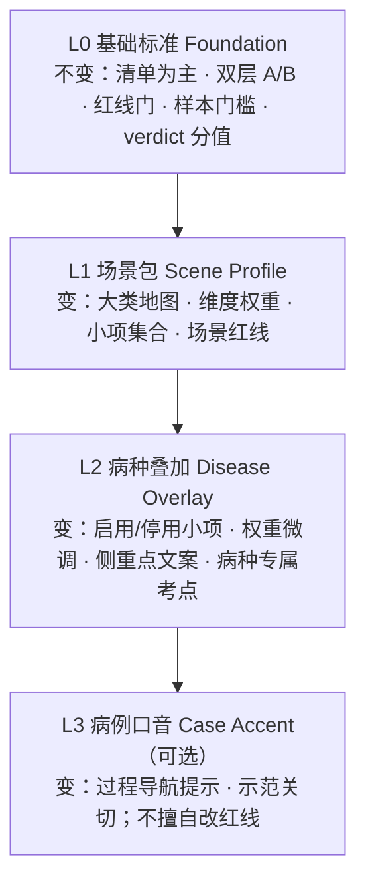
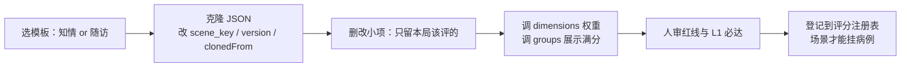

# 场景 × 病种 · 评分设计方案（PRD 3.0）

> **状态：** 设计真源（2026-09-10）。实现可分期；**先按本文建表，再改引擎挂接。**  
> **一句话：** 基础判定规则不变；**换场景 / 换病种只调「评什么、侧重点、权重」**，禁止整表硬套知情或随访旧清单。  
> **关联：** [PRD2.0/09-评分体系与练习考核.md](../PRD2.0/09-评分体系与练习考核.md) · [评分设计说明.md](../评分设计说明.md) · [01-管理端三选一新建.md](./01-管理端三选一新建.md)

---

## 〇、为什么要单独写这篇

管理端已支持「新增场景 / 新增病例 / 新增病人」。但评分现状是：

| 现状 | 风险 |
|------|------|
| `load_rubric(scene_key)` 只认知情 / 随访两张整表 | 新场景只能误挂旧表，或根本没有正确清单 |
| 病种（HTN / T2DM…）不参与选表 | 同是随访，高血压漏服与糖尿病低血糖侧重点不同，却用同一套权重与小项开关 |
| 新建病例没有「评分包」步骤 | 老师以为发布就能评，实际引擎仍按旧场景默认表算 |

**结论：** 基础标准（清单为主、双层、红线、样本门槛）**继承 PRD2.0-09**；场景与病种必须有 **可克隆、可差分、可版本化** 的评分包设计。

---

## 一、四层模型（从稳到活）



| 层 | 改什么 | 谁批准 | 举例 |
|----|--------|--------|------|
| **L0 基础** | 几乎不改 | 产品 + 评分负责人 | pass=1 / uncertain=0.5 / fail=0；≥3 轮且 ≥120 字才给参考分；红线一票否决；反馈以清单为主 |
| **L1 场景** | 换沟通局必新建/克隆 | 带教 + 人审红线 | 知情 vs 随访：维度名与权重不同；新场景「风险解释」另开一包 |
| **L2 病种** | 同场景换病种必叠加 | 带教标定 | 随访×HTN：漏服/血压日记加重；随访×T2DM：低血糖/胰岛素笔加重 |
| **L3 病例** | 可选，轻量 | 发布人审 | 某病人特别怕被骂 → 沟通大类导览提示更醒目；**不**把红线改成可选项 |

**硬规则：**

1. **禁止**「新场景直接指向 `scoring-rubric.json` 不知情同意」而不改小项。  
2. **禁止**病种 overlay 关闭 L0 红线门或取消样本门槛。  
3. **允许**同场景多病种共用 L1，再各自挂 L2。  
4. **新增病人**（同场景同病种换人）默认 **不新建评分包**，继承该病例已绑定的 L1+L2。

---

## 二、L0 基础标准（冻结清单）

以下与 PRD2.0-09 / `评分设计说明.md` 对齐，**新场景新病种不得另起炉灶**：

| 约定 | 取值 | 说明 |
|------|------|------|
| 主反馈 | 清单 pass / uncertain / fail + 证据 | 不能只有总分 |
| 参考分 | 0～100，教学汇总 | UI 须标「参考」 |
| verdict 分值 | 1.0 / 0.5 / 0.0 | 维度内 earned/max |
| 默认达标线 | 参考分 ≥ 60 + L1 全过 + 无红线 fail | 可按场景在 L1 改 `passScore`，须写理由 |
| 样本门槛 | ≥3 轮学员发言且 ≥120 字 | 不足则无参考分，温和提示 |
| 双层 | A 小项算分；B 大类展示折算 | 大类分 ≠ 另一套总分公式 |
| 红线 | `isGate` / `hardFail` | 一票否决，须人审 |

引擎落点（现行）：`server/app/scoring_engine.py`。

---

## 三、L1 场景包（Scene Profile）

### 3.1 一份场景包包含什么

| 块 | 字段（建议） | 作用 |
|----|--------------|------|
| 身份 | `scene_key` · `sceneLabel` · `version` · `clonedFrom` | 追溯从哪张模板克隆 |
| 计分模型 | `scoringModel.dimensions[]`（id/name/weight/isGate）· `passScore` | **侧重点**主要改这里 |
| 展示模型 | `groups[]`（id/name/displayMax/order） | 学员开练地图与报告折叠 |
| 小项 | `items[]`（id/title/pass/fail/layer/group_id/enabledMvp/hardFail/sources…） | **评什么** |
| 绑定 | `rubricFile` 或 registry 路径 | 引擎加载 |

### 3.2 现行两包（对照，勿混用）

| 场景 | 文件 | 维度权重（教学约定） | 大类侧重点 |
|------|------|----------------------|------------|
| 知情同意 `informed_consent` | `web/data/scoring-rubric.json` | L1 50% · 关切 30% · L2 20% | 试验内容、退出/疗效关切、流程权利 |
| 随访 `follow_up` | `web/data/scoring-rubric-followup.json` | L1 55% · 安排 25% · 沟通 20% | 漏服/AE/合并用药核查、非责备提问 |

> 权重是训练约定，可标定后改；**不是**法规法定分，**不是**问卷赋分。

### 3.3 新建场景时怎么出评分包（流程）



**验收（场景包可挂前）：**

- [ ] `scene_key` 与管理端场景条目一致  
- [ ] 维度权重之和 = 1.0（不含红线门）  
- [ ] 每个 `enabledMvp` 小项有合法 `group_id`  
- [ ] 至少 1 条红线项；红线不进加权维度  
- [ ] `clonedFrom` + changelog 写明相对模板改了什么  

**未完成评分包的场景：管理端「新增病例/病人」不得选该场景发布进学员端。**（产品闸门，实现分期）

---

## 四、L2 病种叠加（Disease Overlay）

### 4.1 为什么不能「场景一套打天下」

同一「随访」：

| 病种 | 侧重点应不同 | 若硬套通用随访 |
|------|--------------|----------------|
| 高血压 HTN | 漏服、血压记录、合并降压药 | 低血糖等项噪声大或永远 N/A |
| 2 型糖尿病 T2DM | 低血糖、胰岛素/口服药时点、饮食运动 | 血压日记权重虚高 |
| （未来）肿瘤等 | AE 分级沟通、住院史 | 通用表不够用 |

同一「知情」：

| 病种 | 侧重点 | 说明 |
|------|--------|------|
| T2DM 知情 | 代谢类风险、生活方式影响、长期随访义务 | 相对心血管试验，风险话术重心不同 |
| HTN 知情 | 血压相关风险、合并用药、急救联系 | 与糖尿病知情小项启用集不同 |

### 4.2 Overlay 允许改的范围

| 允许 | 禁止 |
|------|------|
| `itemOverrides`：`enabledMvp` true/false | 删除 L0 样本门槛 |
| `weightDelta` 或整表替换 `dimensions`（须声明） | 把 `hardFail` 红线改成普通项且无人审 |
| `emphasisNotes`：带教/学员可见的侧重点说明 | 无 changelog 的静默改权重 |
| 增补病种专属小项（新 id，挂到已有 group） | 与场景包 `scene_key` 不一致仍强行叠加 |

### 4.3 Overlay 文件形态（建议）

路径约定（实现时可落盘）：

```text
web/data/scoring/
  foundation.json                 # 可选：L0 常量说明（文档化即可）
  scenes/
    informed_consent.json         # 或继续用现有 scoring-rubric.json（兼容）
    follow_up.json
    {new_scene_key}.json
  overlays/
    follow_up__HTN.json
    follow_up__T2DM.json
    informed_consent__T2DM.json
    {scene_key}__{disease_code}.json
  registry.json                   # 场景→基表；场景+病种→overlay
```

**Overlay 示例结构：**

```json
{
  "meta": {
    "scene_key": "follow_up",
    "disease_code": "HTN",
    "version": "1.0.0",
    "basedOnSceneRubric": "scoring-rubric-followup.json",
    "changelog": "高血压随访：加重漏服与血压日记；关闭与低血糖强绑定的可选演示项"
  },
  "scoringModelPatch": {
    "dimensions": [
      { "id": "L1", "weight": 0.60 },
      { "id": "L2", "weight": 0.20 },
      { "id": "communication", "weight": 0.20 }
    ]
  },
  "itemOverrides": [
    { "id": "FU-P0x", "enabledMvp": true, "weightHint": "high" },
    { "id": "FU-P0y", "enabledMvp": false, "reason": "非高血压考点" }
  ],
  "emphasis": {
    "traineeBrief": "本局侧重：规律服药、漏服原因、血压自我监测，避免责备。",
    "instructorNote": "L1 权重略提到 60%，突出核查密度。"
  }
}
```

解析顺序（引擎目标行为）：

1. 加载 L1 场景包  
2. 若病例有 `disease_code` 且 registry 有 overlay → 合并 patch  
3. 若病例声明 `rubric_ref` / `overlay_ref` → 以病例钉死的为准（人审发布时写入）  
4. 输出 **有效评分表**（effective rubric）再跑 `run_scoring`

---

## 五、L3 病例口音（可选、轻量）

用于「新增病人」：同场景同病种，只换策略。

| 可写在病例 JSON | 用途 |
|-----------------|------|
| `scoring.emphasis` | 开练 briefing 多一句侧重点 |
| `scoring.navBoostGroupIds` | 过程进度对某大类更敏感（仍非正式分） |
| `scoring.rubric_ref` / `overlay_ref` | 钉死用哪包（例外情况） |

**默认：** 新病人继承所属病例的 scene + disease overlay，**不**复制一整份 rubric。

---

## 六、注册表 `registry.json`（灵活调整的中枢）

```json
{
  "version": "3.0",
  "scenes": {
    "informed_consent": {
      "label": "知情同意",
      "rubric": "scoring-rubric.json",
      "status": "production"
    },
    "follow_up": {
      "label": "随访（询问）",
      "rubric": "scoring-rubric-followup.json",
      "status": "production"
    }
  },
  "overlays": {
    "follow_up|HTN": "overlays/follow_up__HTN.json",
    "follow_up|T2DM": "overlays/follow_up__T2DM.json"
  },
  "rules": {
    "missingOverlay": "use_scene_rubric_and_flag_warning",
    "publishRequiresRubric": true,
    "newSceneRequiresClone": true
  }
}
```

| 管理端动作 | 注册表要求 |
|------------|------------|
| 新增场景 | 可先 `status: draft`；**发布可练前**必须有 L1 包且红线人审 |
| 新增病例 | 选 scene + disease → 解析 effective rubric → 审核页展示「将用哪套清单/权重」 |
| 新增病人 | 继承病例绑定；审核页只读展示评分包版本 |

---

## 七、侧重点怎么调（操作手册）

### 7.1 只想「同一场景，换病种更准」

1. 复制 `overlays/_template.json` → `follow_up__XXX.json`  
2. 只改 `itemOverrides` + 必要的 `scoringModelPatch`  
3. changelog 写清「相对通用随访改了什么」  
4. 登记 `overlays["follow_up|XXX"]`  
5. 用 1 份该病种对话跑通清单，核对无大面积 N/A

### 7.2 只想「新开一种沟通局」

1. 从知情或随访克隆 L1（选更近的模板）  
2. 重写 `groups` 名称与 `displayMax`（学员地图）  
3. 重写/裁剪 `items`；红线单独人审  
4. 调 `dimensions` 权重（侧重点）  
5. registry `scenes[new_key]`；管理端场景页才能从 draft → 可挂  

### 7.3 调权重的纪律

| 做法 | 要求 |
|------|------|
| ±5% 内微调 | changelog 一行即可 |
| 单维变动 ≥10% | 须写教学理由 + 至少 2 场试评对比 |
| 增删 L1 必达项 | 必须人审；同步改开练导览文案 |

---

## 八、与现行代码的差距（实现分期）

| 阶段 | 做什么 | 验收 |
|------|--------|------|
| **P0 文档**（本文） | 四层模型 + 流程 + registry 约定 | 带教能按手册出 overlay 草案 |
| **P1 兼容加载** | `registry.json` + `load_effective_rubric(scene, disease)`；无 overlay 时行为与今天一致 | **已实现**（2026-09-10） |
| **P2 管理端闸门** | 审核页展示 effective 清单摘要；无包不可发布 | **已实现摘要 + 发布闸门** |
| **P3 编辑器（可选）** | 权重/启停可视化，仍导出 JSON | 老师少手改文件 |

现行硬编码对照：`server/app/case_loader.py` → `RUBRIC_BY_SCENE`（仅两场景）。P1 起改为读 registry，旧路径作 fallback。

---

## 九、首批建议落地的 Overlay（示意，非最终分值）

| 组合 | 相对通用表的侧重点 | 建议动作 |
|------|-------------------|----------|
| 随访 × HTN | 漏服、血压监测、合并降压药 | L1 略增；关闭非血压专属可选演示项 |
| 随访 × T2DM | 低血糖、用药时点、饮食运动对血糖 | 增补/启用低血糖相关小项；沟通维保持 |
| 知情 × T2DM | 代谢风险、长期义务、生活方式 | 关切维保持或略增；风险小项启用集对齐糖尿病 |
| 知情 × HTN | 心血管风险、急救与合并用药 | 在知情基表上 itemOverrides |

具体小项 id 以克隆后的表为准，定稿时填进各 overlay 的 `changelog`。

---

## 十、一页验收（给测试 / 答辩）

- [ ] 能说清：L0 不变，L1 随场景，L2 随病种，L3 随病人且极轻  
- [ ] 新场景不能直接冒充知情/随访整表而不改小项  
- [ ] 同场景不同病种，effective 清单或权重至少有一处可见差异  
- [ ] 审核/说明里能指出「当前用的评分包版本」  
- [ ] 参考分仍标注教学参考；清单仍是主结果  

更细的勾选见 [05-评分包测试清单.md](./05-评分包测试清单.md)。
