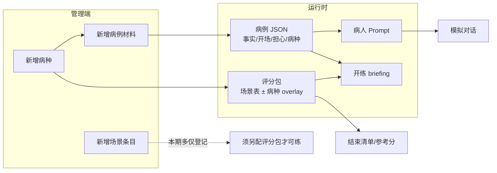

# 场景 × 病种 × 病例 → 对话如何贴合（说明）

> 回应：「新增了场景/病种/病例后，模拟对话怎么体现？考虑过吗？」  
> **短答：病例事实与病种锚定会进 SP Prompt；场景专用规则目前主要覆盖知情/随访；全新场景要可练还须评分包 + 白名单。**

---

## 1. 三条链路（谁驱动什么）

| 对象 | 进对话？ | 进评分？ | 进开练页？ |
|------|----------|----------|------------|
| 病例锁死事实 / 开场 / 担心 | **是（主）** | 间接（语义判项） | 是 |
| 病种 code/名称 | **是（病种锚定）** | overlay 有则改权重/启停 | **是** |
| 知情 / 随访 | **是（专用扮演规则）** | 两张生产表 | 是 |
| 新场景条目 alone | 弱（通用「自定义场景」规则） | 无包则**不能发布可练** | 否 |

---

## 2. 你现在能「听出来」的差异

对 **随访 × COPD × 周阿姨**：

1. 开场应提吸药/咳嗽/带孙子，而不是血压日记。  
2. 漏吸先含糊，追问后才说顾孙子、忘带吸入器。  
3. 合并用药可带到止咳/感冒药。  
4. briefing 显示病种 COPD + 侧重点（若有）。

对 **只登记的新场景（如家属协同）**：  
列表能看见，但**不要**指望本周学员端已能选该局开练——须：`registry` production 包 + ingest 白名单 +（建议）专用 `scene_rules`。

---

## 3. 代码落点（已加强）

| 文件 | 作用 |
|------|------|
| `patient_agent.build_patient_system_prompt` | 【场景】【病种锚定】【本局侧重点】+ 知情/随访规则；其它场景走自定义场景规则 |
| `case_loader.case_fact_digest` | digest 带 `disease` / `scene_*` / `scoring_emphasis` |
| `case_ingest` 发布 | 病例写入 `scoring.emphasis.patientStance` |
| 开练 briefing | 展示病种行 +「本局侧重点」 |

---

## 4. 还没做完的（诚实清单）

- 新场景一键克隆评分包 UI  
- 把任意新场景加入 ingest 白名单的产品闸门（人审红线）  
- COPD 专用 overlay 文件（可后补 `follow_up__COPD.json`）  
- 自定义场景的细粒度扮演模板库（家属在场、电话随访等）

闭环测试步骤仍见 [06-闭环测试材料-场景病种病例.md](./06-闭环测试材料-场景病种病例.md)。
