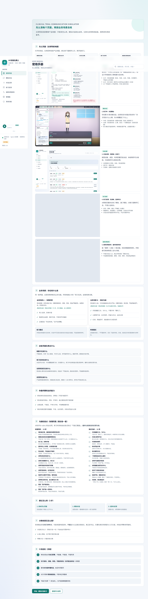
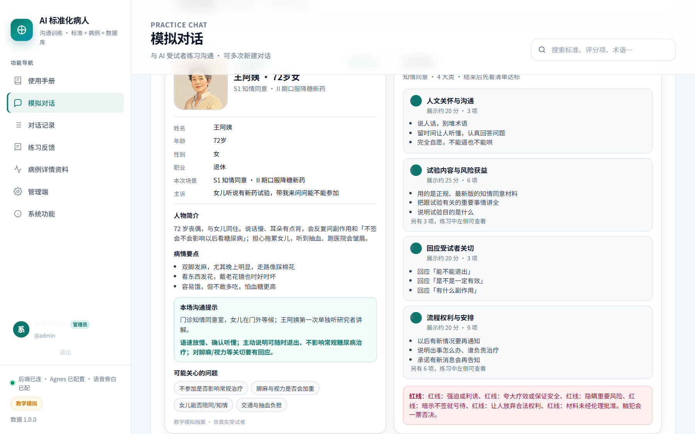
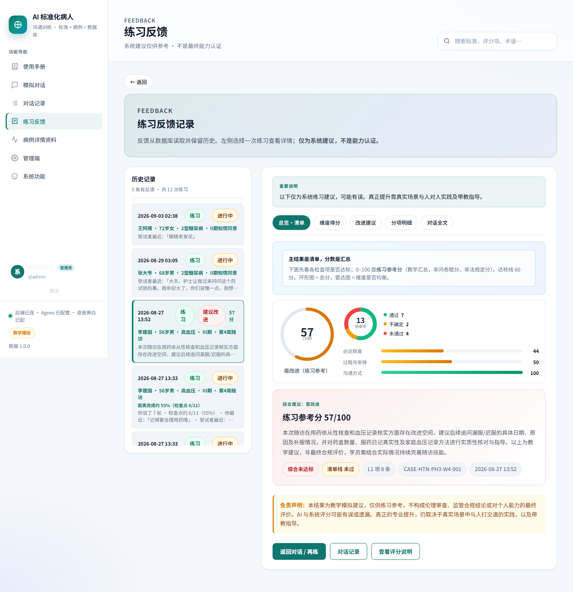
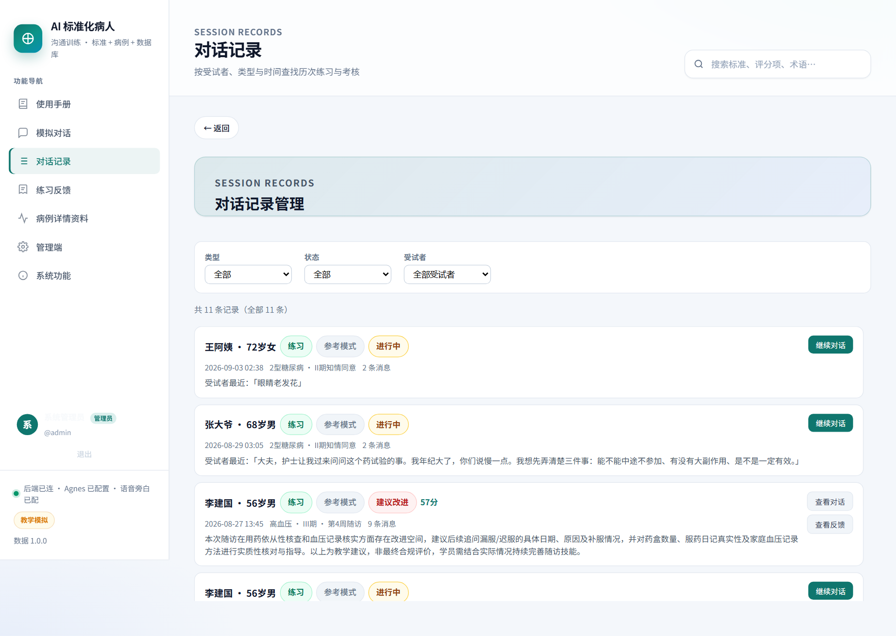
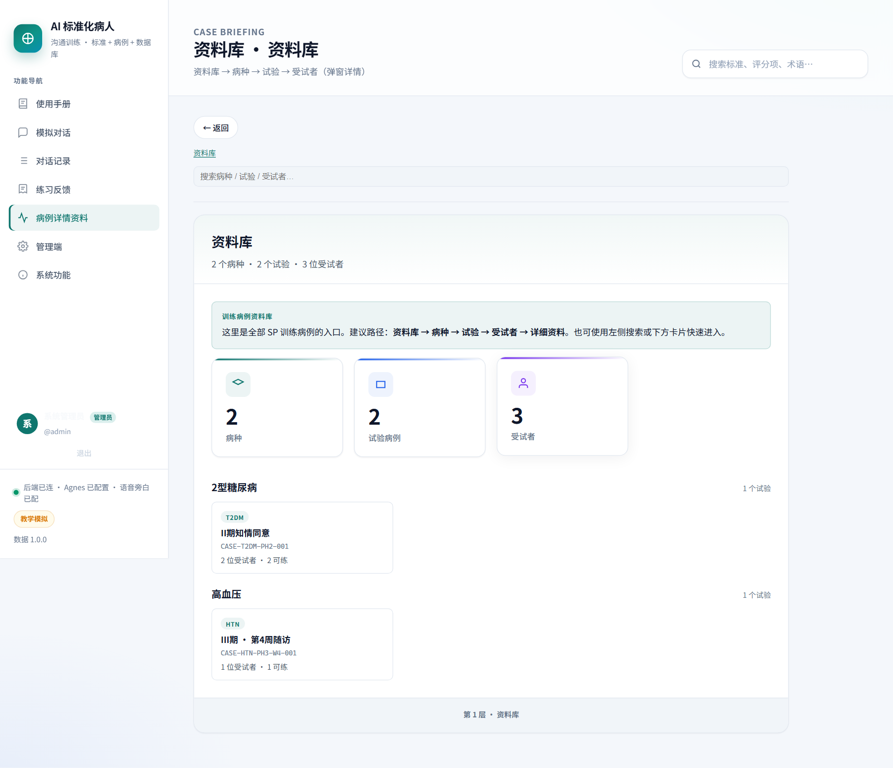
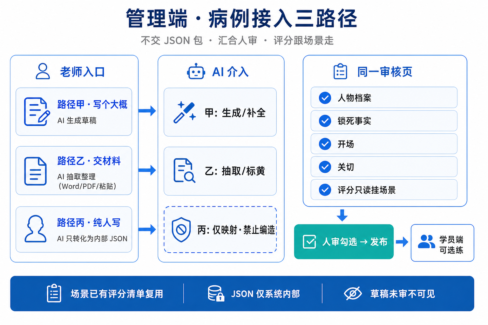
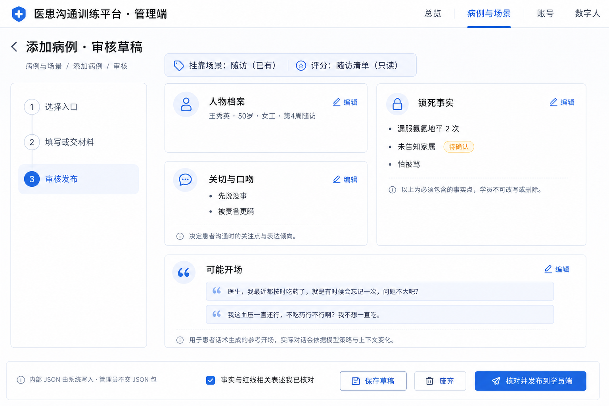

# AISP 产品介绍（人话版）

> **一句话：** 用 AI 当「标准化受试者」，让你反复练临床试验沟通，练完告诉你哪里说到了、哪里漏了。  
> **重要提醒：** 这是**教学陪练**，分数是练习参考，**不是**合规认证、也不是上岗考试结论。  
> **本地演示：** http://127.0.0.1:8000/ · 仓库：[GitHub](https://github.com/hongwei-2026/datawhale_yiliao)  
> **贴飞书提示：** 截图都单独成段，不要塞进表格里。

---

## 1. 这是个啥？

临床试验里，研究者要经常跟「试药的人」说话：

- 入组前：把试验讲清楚（知情同意）
- 入组后：问药吃没吃、有没有不舒服（随访）

真人标准化病人（SP）能练，但**贵、难约、每次表现还不一样**。

**AISP** 做的事很简单：

- **AI 负责：** 扮演有性格、有病史的受试者；按病例事实回答，不瞎编大病；结束后对照清单给反馈。  
- **你负责：** 开口问、开口讲；把该讲清的讲清、该问到的问到；看漏项，再练一趟。

---

## 2. 为啥要做？

说白了就四条：

1. **练不够** —— 真人 SP 排不过来，新人练不了几次。  
2. **不好比** —— 今天脾气好、明天状态差，分数难横向对比。  
3. **不好改** —— 练完老师一句话「还行」，你不知道漏了哪条。  
4. **场景难复现** —— 隐瞒漏服、听不清、家属插话，真人不好稳定演。

AISP 想解决的是：**随时能练、练完能对清单、下次知道改什么。**

---

## 3. 给谁用？

- **学员**（CRC / 研究护士 / 医学生）：选关 → 对话 → 看反馈 → 再练。  
- **带教 / 老师：** 看练习记录与反馈，当面复盘比只看分数更重要。  
- **管理员：** 建场景 / 病种 / 病例，审核后发布到学员端。

---

## 4. 学员端长什么样？（带截图）

### 4.1 使用手册：先搞清楚「怎么练」

进系统先看使用手册：主线就是 **选关 → 对话 → 对照清单改**。



### 4.2 开练前：这一关练什么、对手是谁

点「模拟对话」不会上来就聊天，先看：

- 这一关练什么（知情 / 随访等）
- 对手档案（脾气、听力、会不会隐瞒）
- 任务地图与红线（不能逼、不能夸大疗效……）



### 4.3 练习中：跟 AI 受试者说话

中间是对话；左侧会提示对方大概什么心情、你大概覆盖了哪些检查点（过程提示，**最终以结束反馈为准**）。


你可以打字，也可以用语音（环境配好的话）。觉得练完了，自己点「结束」，系统才评分。

### 4.4 练完：先看清单，再看参考分

反馈页原则是 **清单优先**：

- 哪些必达项过了 / 没过
- 尽量带对话里的原句当证据
- 0～100 参考分只是汇总，**不是认证**



### 4.5 历史对话：随时找回

按人、按时间找回某次练习：没结束的可以继续，结束了的可以跳去反馈。



### 4.6 病例资料库：备考用，不是主入口

想先熟悉方案、病史，可以来「病例详情资料」。真正开练请回「模拟对话」。



---

## 5. 管理端在干什么？

学员端负责「练」；管理端负责「把能练的病例送进去」。

日常主战场是 **病例与场景**：

1. 新建场景 / 病种 / 病例（三选一，不堆一页）  
2. 材料可以：写大概、交 ZIP、或纯人写  
3. 草稿 → 人审 → 发布  

先看材料怎么接进来：



再看审核练习卡片（会核对「和现有练习能不能接上」——场景是否正式、评分能不能挂上等）：



**人话规则：**

- **测试场景**：可以写草稿，**不能**发到学员端。  
- **正式场景**：管理员点「设为正式」后，才能发布给学员练。  
- AI 可以帮整理文稿，**医学事实和红线仍要人审**。

---

## 6. 现在能练什么？

- **知情同意：** 讲清目的、流程、风险、自愿退出。例子：张大爷 / 王阿姨等。  
- **随访沟通：** 问漏服、不适、合并用药、核对记录。例子：李建国（怕被批评）。  
- **家属协同等扩展：** 跟家属一起沟通（需管理员设为正式并发布）。例子：周阿姨 × COPD 闭环样例。

两种练法：

- **练习模式：** 过程提示多、可看参考。  
- **考核模式：** 提示更少、更像考试，交卷后仍有完整反馈。

---

## 7. 系统怎么工作？（不用懂代码）

```text
你选一个人开练
    ↓
AI 按「病例事实 + 性格」回答（事实锁死，说法可以口语化）
    ↓
你点结束
    ↓
系统对照评分清单：你说到了没有（只评你说的，病人自己蹦出来的不算）
    ↓
反馈：清单 + 证据句 + 参考分 + 改进建议
```

两样东西必须同时在：

1. **尺子** —— 知情 / 随访等评分标准  
2. **病人** —— 具体病例与人设  

缺一个就不该随便发到学员端乱练。

---

## 8. 明确不做啥（边界）

- 不替代真实知情同意签字  
- 不给出院所正式合规 / 上岗认证  
- 不对接真实招募或医院 EDC  
- 分数不能当成「你已经合格了」

界面和使用手册都会强调：**练习建议，人终审才靠谱。**

---

## 9. 你怎么自己跑起来？

```bash
pip install -r server/requirements.txt
cp .env.example .env   # 填 AGNES_API_KEY 等
python -m uvicorn server.app.main:app --host 127.0.0.1 --port 8000
```

浏览器打开：http://127.0.0.1:8000/

常用入口：

- 使用手册：`/#guide`  
- 模拟对话：`/#practice`  
- 练习反馈：`/#feedback`  
- 管理端：登录后进「病例与场景」（默认管理员账号见部署说明）

更细的阶段说明见：[PRD3.0 阶段汇总](./PRD3.0/08-阶段汇总-管理端闭环与发布.md)。

---

## 10. 相关文档

- [项目计划书（人话版）](./项目计划书.md) —— 做到哪了、下一步干啥  
- [PRD3.0 索引](./PRD3.0/README.md) —— 管理端与评分扩展细节  
- [评分设计说明.md](./评分设计说明.md) —— 清单怎么打分  
- [AISP-技术架构.md](./AISP-技术架构.md) —— 技术向（可选）

---

*文档版本：2026-09 · 截图来自本地演示界面，随版本可能略有差异。*
